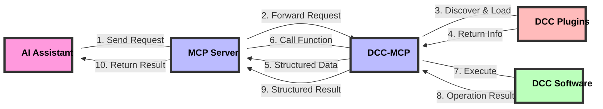

# dcc-mcp-core

Foundational library for the DCC Model Context Protocol (MCP) ecosystem. It provides common utilities, base classes, and shared functionality that are used across all other DCC-MCP packages.

## Design Philosophy and Workflow

DCC-MCP-Core is a plugin management system designed for Digital Content Creation (DCC) applications, aiming to provide a unified interface that allows AI to interact with various DCC software (such as Maya, Blender, Houdini, etc.).

### Core Workflow

1. **MCP Server**: Acts as a central coordinator, receiving requests from AI
2. **DCC-MCP**: Connects the MCP server and specific DCC software
3. **Plugin Discovery and Loading**: DCC-MCP-Core is responsible for discovering, loading, and managing plugins
4. **Structured Information Return**: Returns plugin information in an AI-friendly structured format to the MCP server
5. **Function Calls and Result Return**: MCP server calls the corresponding plugin functions and returns the results to AI



### Plugin Design

Plugins use a simple and intuitive design, allowing developers to easily create new DCC functionality:

- **Metadata Declaration**: Define basic plugin information through simple variables
- **Function Definition**: Implement specific DCC operation functionality
- **Context Passing**: Access DCC software's remote interface through the context parameter
- **Structured Return**: All functions return standardized structured data

### Remote Call Architecture

DCC-MCP-Core uses RPyC to implement remote procedure calls, allowing DCC operations to be executed in different processes or even on different machines:

- **Context Object**: Contains remote DCC client and command interface
- **Transparent Access**: Plugin code can access remote DCC APIs as if they were local
- **Error Handling**: Unified error handling mechanism ensures stable operation

## Package Structure

DCC-MCP-Core is organized into several subpackages:

- **actions**: Action management and generation
  - `generator.py`: Generates action templates
  - `manager.py`: Manages action discovery and loading
  - `metadata.py`: Defines action metadata structures

- **models**: Data models for the MCP ecosystem
  - `action_result.py`: Structured result model for actions

- **parameters**: Parameter handling and validation
  - `groups.py`: Parameter grouping and dependencies
  - `models.py`: Parameter data models
  - `processor.py`: Parameter processing utilities
  - `validation.py`: Parameter validation logic

- **templates**: Template handling
  - `utils.py`: Template rendering with Jinja2

- **utils**: Utility functions and helpers
  - `constants.py`: Common constants
  - `decorators.py`: Function decorators for error handling and result formatting
  - `exceptions.py`: Exception hierarchy
  - `platform.py`: Platform-specific utilities
  - `template.py`: Template utilities

## Features

- Parameter processing and validation
- Standardized logging system
- Common exception hierarchy
- Utility functions for DCC integration
- Version compatibility checking
- Plugin management system for DCC-specific functionality
- AI-friendly structured data interfaces
- Remote procedure call support via RPyC

## Requirements

- Python 3.7+
- Compatible with Windows, macOS, and Linux
- Designed to work within DCC software Python environments

## Installation

```bash
pip install dcc-mcp-core
```

## Usage

### Basic Usage

```python
from dcc_mcp_core.actions.manager import ActionManager
from dcc_mcp_core import filesystem

# Initialize an action manager for a specific DCC application
action_manager = ActionManager("maya")

# Discover and load all available actions
action_manager.discover_actions()

# Get information about all loaded actions (AI-friendly structured data)
actions_info = action_manager.get_all_actions_info()
for name, info in actions_info.items():
    print(f"Action: {name}")
    print(f"  Version: {info['version']}")
    print(f"  Description: {info['description']}")
    print(f"  Functions: {len(info['functions'])}")

# Call a specific action function
result = action_manager.call_action_function(
    "maya_action",           # Action name
    "create_cube",           # Function name
    size=2.0,                # Function arguments
    context={"maya": True}   # Context for DCC integration
)

# Get custom action paths
action_paths = filesystem.get_action_paths()
```

### Action Management

The action management system allows you to discover, load, and interact with DCC-specific actions:

```python
from dcc_mcp_core.actions.manager import ActionManager

# Create an action manager for a specific DCC
manager = ActionManager('maya')

# Discover available actions
action_paths = manager.discover_actions()
print(f"Found {len(action_paths)} actions for Maya")

# Load all discovered actions
actions_info = manager.load_actions(action_paths)
print(f"Loaded actions: {list(actions_info.keys())}")

# Get structured information about actions (AI-friendly format)
actions_info = manager.get_actions_info()

# Call a function from a specific action
result = manager.call_action_function('maya_scene_tools', 'create_primitive',
                                    context=context, primitive_type="cube", size=2.0)
```

### Creating Custom Actions

Create a Python file with the following structure to make it discoverable by the action system:

```python
# my_maya_action.py

# Action metadata
__action_name__ = "My Maya Action"
__action_version__ = "1.0.0"
__action_description__ = "A custom action for Maya"
__action_author__ = "Your Name"
__action_requires__ = ["maya"]

# Using decorators to simplify action function development
from dcc_mcp_core.utils.decorators import error_handler, format_result

# Action functions
@error_handler
@format_result
def create_cube(context, size=1.0, position=None):
    """Create a cube in Maya."""
    cmds = context.get("maya_client").cmds

    if position is None:
        position = [0, 0, 0]

    # Create the cube
    cube = cmds.polyCube(w=size, h=size, d=size)[0]
    cmds.move(position[0], position[1], position[2], cube)

    return {
        "success": True,
        "message": "Successfully created cube",
        "context": {
            "name": cube,
            "type": "cube",
            "size": size,
            "position": position
        }
    }
```

## License

MIT
