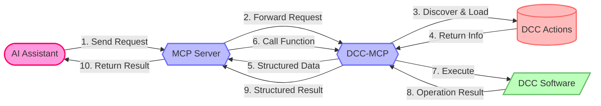

# dcc-mcp-core

[](https://pypi.org/project/dcc-mcp-core/)
[](https://www.python.org/)
[](https://opensource.org/licenses/MIT)
[](https://pepy.tech/project/dcc-mcp-core)
[](https://codecov.io/gh/loonghao/dcc-mcp-core)
[](https://github.com/loonghao/dcc-mcp-core/actions)
[](http://makeapullrequest.com)
[](https://github.com/loonghao/dcc-mcp-core/releases)

[中文文档](README_zh.md) | [English](README.md)

Foundational library for the DCC Model Context Protocol (MCP) ecosystem. **Rust-powered core** (PyO3) with **zero Python runtime dependencies**, providing action registry, structured results, event system, skills/script registration, MCP protocol types, and platform utilities for Digital Content Creation applications (Maya, Blender, Houdini, etc.).

> **Note**: This project is in early development stage. The API may change at any time without prior notice.

## Design Philosophy and Workflow

DCC-MCP-Core is an action management system designed for Digital Content Creation (DCC) applications, aiming to provide a unified interface that allows AI to interact with various DCC software.

### Core Workflow


```mermaid
flowchart LR
    AI([AI Assistant]):::aiNode
    MCP{{MCP Server}}:::serverNode
    DCCMCP{{DCC-MCP}}:::serverNode
    Actions[(DCC Actions)]:::actionsNode
    DCC[/DCC Software/]:::dccNode

    AI -->|1. Send Request| MCP
    MCP -->|2. Forward Request| DCCMCP
    DCCMCP -->|3. Discover & Load| Actions
    Actions -->|4. Return Info| DCCMCP
    DCCMCP -->|5. Structured Data| MCP
    MCP -->|6. Call Function| DCCMCP
    DCCMCP -->|7. Execute| DCC
    DCC -->|8. Operation Result| DCCMCP
    DCCMCP -->|9. Structured Result| MCP
    MCP -->|10. Return Result| AI

    classDef aiNode fill:#f9d,stroke:#f06,stroke-width:2px,color:#333
    classDef serverNode fill:#bbf,stroke:#66f,stroke-width:2px,color:#333
    classDef dccNode fill:#bfb,stroke:#6b6,stroke-width:2px,color:#333
    classDef actionsNode fill:#fbb,stroke:#f66,stroke-width:2px,color:#333
```

## Architecture

DCC-MCP-Core uses a Rust workspace with 5 sub-crates, compiled into a single Python extension module `dcc_mcp_core._core`:

```
dcc-mcp-core/                      # Rust workspace root
├── src/lib.rs                     # PyO3 module entry point → _core.pyd/.so
├── python/dcc_mcp_core/
│   ├── __init__.py                # Python re-exports from _core
│   └── py.typed                   # PEP 561 marker
└── crates/
    ├── dcc-mcp-models/            # ActionResultModel, SkillMetadata
    ├── dcc-mcp-actions/           # ActionRegistry (DashMap), EventBus (pub/sub)
    ├── dcc-mcp-protocols/         # MCP type definitions (Tools, Resources, Prompts)
    ├── dcc-mcp-skills/            # SKILL.md scanning and loading
    └── dcc-mcp-utils/             # Filesystem, constants, type wrappers, logging
```

All Python imports come from the top-level `dcc_mcp_core` package:

```python
from dcc_mcp_core import (
    ActionResultModel, ActionRegistry, EventBus,
    SkillScanner, SkillMetadata,
    ToolDefinition, ToolAnnotations,
    ResourceDefinition, ResourceTemplateDefinition,
    PromptArgument, PromptDefinition,
    success_result, error_result, from_exception, validate_action_result,
    get_config_dir, get_data_dir, get_log_dir, get_actions_dir, get_skills_dir,
    wrap_value, unwrap_value, unwrap_parameters,
    BooleanWrapper, IntWrapper, FloatWrapper, StringWrapper,
)
```

## Features

- **Rust-Powered Core** — All logic implemented in Rust via PyO3 for maximum performance
- **Zero Python Dependencies** — Python 3.8+ with no third-party runtime dependencies
- **ActionRegistry** — Thread-safe action registration and lookup using DashMap for lock-free concurrent reads
- **ActionResultModel** — Structured result type (success, message, prompt, error, context) with factory functions
- **EventBus** — Thread-safe publish/subscribe event system for decoupled component communication
- **Skills System** — Zero-code registration of scripts (Python, MEL, MaxScript, BAT, Shell, PowerShell, JavaScript) as MCP tools via SKILL.md
- **MCP Protocol Types** — Full [MCP specification](https://modelcontextprotocol.io/specification/2025-11-25) type definitions for Tools, Resources, and Prompts
- **Type Wrappers** — RPyC-compatible type wrappers (BooleanWrapper, IntWrapper, FloatWrapper, StringWrapper) ensuring type safety in remote procedure calls
- **Platform Utilities** — Cross-platform filesystem paths, logging via Rust `tracing`, and constants

## Quick Start

### ActionRegistry

```python
from dcc_mcp_core import ActionRegistry

registry = ActionRegistry()
registry.register(
    name="create_sphere",
    description="Creates a sphere in Maya",
    dcc="maya",
    tags=["geometry", "creation"],
    input_schema='{"type": "object", "properties": {"radius": {"type": "number"}}}',
)

# Query actions
meta = registry.get_action("create_sphere", dcc_name="maya")
names = registry.list_actions_for_dcc("maya")
dccs = registry.get_all_dccs()
```

### ActionResultModel

```python
from dcc_mcp_core import success_result, error_result, from_exception

# Success result with context
result = success_result("Created sphere", prompt="Modify next", object_name="sphere1")
print(result.success)   # True
print(result.message)   # "Created sphere"
print(result.context)   # {"object_name": "sphere1"}

# Error result
error = error_result(
    "Failed to create",
    "File not found: /bad/path",
    prompt="Check file path",
    possible_solutions=["Check if file exists"],
)

# Create modified copies
with_err = result.with_error("Something went wrong")
with_ctx = result.with_context(extra_data="value")
d = result.to_dict()
```

### EventBus

```python
from dcc_mcp_core import EventBus

bus = EventBus()

def on_action_done(**kwargs):
    print(f"Action: {kwargs.get('action_name')}, success: {kwargs.get('success')}")

sub_id = bus.subscribe("action.completed", on_action_done)
bus.publish("action.completed", action_name="create_sphere", success=True)
bus.unsubscribe("action.completed", sub_id)
```

### Skills System

Register any script as an MCP tool with zero code. Directly reuses the [OpenClaw Skills](https://docs.openclaw.ai/tools) ecosystem format.

1. **Create a Skill directory** with `SKILL.md` and `scripts/`:

```
maya-geometry/
├── SKILL.md
├── scripts/
│   ├── create_sphere.py
│   ├── batch_rename.mel
│   └── export_fbx.bat
└── metadata/          # Optional
    ├── depends.md
    └── help.md
```

2. **Write the SKILL.md** (YAML frontmatter):

```yaml
---
name: maya-geometry
description: "Maya geometry creation and modification tools"
tools: ["Bash", "Read"]
tags: ["maya", "geometry"]
dcc: maya
version: "1.0.0"
---
# Maya Geometry Skill

Use these tools to create and modify geometry in Maya.
```

3. **Set environment variable** and scan:

```bash
export DCC_MCP_SKILL_PATHS="/path/to/my-skills"
```

```python
from dcc_mcp_core import SkillScanner, scan_skill_paths, parse_skill_md

scanner = SkillScanner()
skill_dirs = scanner.scan(extra_paths=["/my/skills"], dcc_name="maya")

# Or use convenience function
skill_dirs = scan_skill_paths(extra_paths=["/my/skills"], dcc_name="maya")

# Parse a specific skill
metadata = parse_skill_md("/path/to/maya-geometry")
```

#### Supported Script Types

| Extension | Type | Execution |
|-----------|------|-----------|
| `.py` | Python | `subprocess` with system Python |
| `.mel` | MEL (Maya) | Via DCC adapter in context |
| `.ms` | MaxScript | Via DCC adapter in context |
| `.bat`, `.cmd` | Batch | `cmd /c` |
| `.sh`, `.bash` | Shell | `bash` |
| `.ps1` | PowerShell | `powershell -File` |
| `.js`, `.jsx` | JavaScript | `node` |
| `.vbs` | VBScript | `cscript` |

### MCP Protocol Types

```python
from dcc_mcp_core import ToolDefinition, ToolAnnotations, ResourceDefinition, PromptDefinition

tool = ToolDefinition(
    name="create_sphere",
    description="Creates a sphere",
    input_schema='{"type": "object", "properties": {"radius": {"type": "number"}}}',
)

annotations = ToolAnnotations(
    title="Create Sphere",
    read_only_hint=False,
    destructive_hint=False,
    idempotent_hint=True,
)

resource = ResourceDefinition(
    uri="scene://objects",
    name="Scene Objects",
    description="All objects in the current scene",
    mime_type="application/json",
)
```

### Type Wrappers (RPyC)

```python
from dcc_mcp_core import wrap_value, unwrap_value, unwrap_parameters

wrapped = wrap_value(True)          # BooleanWrapper(True)
original = unwrap_value(wrapped)    # True

params = {"visible": wrap_value(True), "count": wrap_value(5)}
unwrapped = unwrap_parameters(params)  # {"visible": True, "count": 5}
```

## Installation

```bash
# Install from PyPI
pip install dcc-mcp-core

# Or install from source
git clone https://github.com/loonghao/dcc-mcp-core.git
cd dcc-mcp-core
pip install maturin
maturin develop --features python-bindings,abi3-py38
```

### Requirements

- **Python**: >= 3.7 (abi3 wheel for 3.8+)
- **Rust**: >= 1.75 (for building from source)
- **Dependencies**: Zero Python runtime dependencies for 3.8+

## Development Setup

```bash
# Clone the repository
git clone https://github.com/loonghao/dcc-mcp-core.git
cd dcc-mcp-core

# Create and activate virtual environment
python -m venv venv
source venv/bin/activate  # On Windows: venv\Scripts\activate

# Install development dependencies
pip install -e ".[dev]"

# Or use vx (recommended)
# See https://github.com/loonghao/vx for vx installation
vx just install
```

## Running Tests

```bash
# Run tests with coverage
vx just test

# Run specific tests
vx uvx nox -s pytest -- tests/test_models.py -v

# Run linting checks
vx just lint

# Run linting with auto-fix
vx just lint-fix

# Run pre-commit hooks
vx just prek-all
```

## Documentation

Full documentation is available at [loonghao.github.io/dcc-mcp-core](https://loonghao.github.io/dcc-mcp-core/).

- [What is DCC-MCP-Core?](https://loonghao.github.io/dcc-mcp-core/guide/what-is-dcc-mcp-core)
- [Getting Started](https://loonghao.github.io/dcc-mcp-core/guide/getting-started)
- [Actions & Registry](https://loonghao.github.io/dcc-mcp-core/guide/actions)
- [Event System](https://loonghao.github.io/dcc-mcp-core/guide/events)
- [Skills System](https://loonghao.github.io/dcc-mcp-core/guide/skills)
- [MCP Protocols](https://loonghao.github.io/dcc-mcp-core/guide/protocols)
- [API Reference](https://loonghao.github.io/dcc-mcp-core/api/models)

## Release Process

This project uses [Release Please](https://github.com/googleapis/release-please) to automate versioning and releases. The workflow is:

1. **Develop**: Create a branch from `main`, make changes using [Conventional Commits](https://www.conventionalcommits.org/)
2. **Merge**: Open a PR and merge to `main`
3. **Release PR**: Release Please automatically creates/updates a release PR that bumps the version and updates `CHANGELOG.md`
4. **Publish**: When the release PR is merged, a GitHub Release is created and the package is published to PyPI

### Commit Message Format

| Prefix | Description | Version Bump |
|--------|-------------|--------------|
| `feat:` | New feature | Minor (`0.x.0`) |
| `fix:` | Bug fix | Patch (`0.0.x`) |
| `feat!:` or `BREAKING CHANGE:` | Breaking change | Major (`x.0.0`) |
| `docs:` | Documentation only | No release |
| `chore:` | Maintenance | No release |
| `ci:` | CI/CD changes | No release |
| `refactor:` | Code refactoring | No release |
| `test:` | Adding tests | No release |

## Contributing

Contributions are welcome! Please feel free to submit a Pull Request.

### Development Workflow

1. Fork the repository and clone your fork
2. Create a feature branch: `git checkout -b feat/my-feature`
3. Make your changes following the coding standards below
4. Run tests and linting:
   ```bash
   vx just lint       # Check code style
   vx just test       # Run tests
   vx just prek-all   # Run all pre-commit hooks
   ```
5. Commit using [Conventional Commits](https://www.conventionalcommits.org/) format
6. Push and open a Pull Request against `main`

### Coding Standards

- **Style**: Code is formatted with `ruff` and `isort` (line length: 120)
- **Type hints**: All public APIs must have type annotations
- **Docstrings**: Google-style docstrings for all public modules, classes, and functions
- **Testing**: New features must include tests; maintain or improve coverage
- **Imports**: Use section headers (`Import built-in modules`, `Import third-party modules`, `Import local modules`)

## License

This project is licensed under the MIT License - see the LICENSE file for details.
