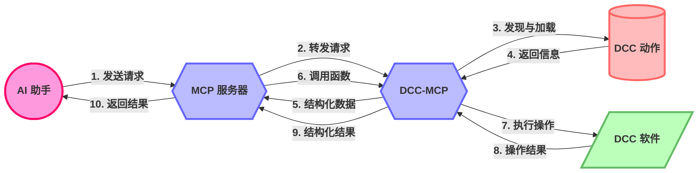

# DCC-MCP-Core

[](https://pypi.org/project/dcc-mcp-core/)
[](https://www.python.org/)
[](https://opensource.org/licenses/MIT)
[](https://pepy.tech/project/dcc-mcp-core)
[](https://codecov.io/gh/loonghao/dcc-mcp-core)
[](https://github.com/loonghao/dcc-mcp-core/actions)
[](http://makeapullrequest.com)
[](https://github.com/loonghao/dcc-mcp-core/releases)

[English](README.md) | [中文文档](README_zh.md)

DCC 模型上下文协议（Model Context Protocol，MCP）生态系统的基础库。它提供了在所有其他 DCC-MCP 包中使用的通用工具、基类和共享功能。

> **注意**：本项目处于早期开发阶段。API 可能会随时变化，我们不会提前发出通知。

## 设计理念与工作流程

DCC-MCP-Core 是一个为数字内容创建(DCC)应用程序设计的动作管理系统，旨在提供一个统一的接口，使 AI 能够与各种 DCC 软件（如 Maya、Blender、Houdini 等）进行交互。

### 核心工作流程

1. **MCP 服务器**：作为中央协调器，接收来自 AI 的请求
2. **DCC-MCP**：连接 MCP 服务器和具体的 DCC 软件
3. **动作发现与加载**：DCC-MCP-Core 负责发现、加载和管理动作
4. **结构化信息返回**：以 AI 友好的结构化格式将动作信息返回给 MCP 服务器
5. **函数调用与结果返回**：MCP 服务器调用相应的动作函数，并将结果返回给 AI



### 动作设计

动作采用简单直观的设计，使开发者能够轻松创建新的 DCC 功能：

- **元数据声明**：通过简单的变量定义动作的基本信息
- **函数定义**：实现特定的 DCC 操作功能
- **上下文传递**：通过上下文参数访问 DCC 软件的远程接口
- **结构化返回**：所有函数返回标准化的结构化数据

### 远程调用架构

DCC-MCP-Core 使用 RPyC 实现远程过程调用，允许在不同进程甚至不同机器上执行 DCC 操作：

- **上下文对象**：包含远程 DCC 客户端和命令接口
- **透明访问**：动作代码可以像访问本地 API 一样访问远程 DCC API
- **错误处理**：统一的错误处理机制确保稳定运行

## 包结构

DCC-MCP-Core 组织为几个子包：

- **actions**：动作管理和执行
  - `base.py`：基础 Action 类定义
  - `manager.py`：用于动作发现和执行的 ActionManager
  - `registry.py`：用于注册和检索动作的 ActionRegistry
  - `middleware.py`：用于横切关注点的中间件
  - `events.py`：用于动作通信的事件系统

- **models**：MCP 生态系统的数据模型
  - `action_result.py`：动作的结构化结果模型

- **utils**：实用函数和辅助工具
  - `module_loader.py`：模块加载工具
  - `filesystem.py`：文件系统操作
  - `decorators.py`：用于错误处理的函数装饰器
  - `dependency_injector.py`：依赖注入工具
  - `template.py`：模板渲染工具
  - `platform.py`：平台特定工具

## 中间件系统

DCC-MCP-Core 包含一个中间件系统，用于在动作执行前后插入自定义逻辑：

```python
from dcc_mcp_core.actions.middleware import LoggingMiddleware, PerformanceMiddleware, MiddlewareChain
from dcc_mcp_core.actions.manager import ActionManager

# 创建中间件链
chain = MiddlewareChain()

# 添加中间件（顺序很重要 - 先添加的先执行）
chain.add(LoggingMiddleware)  # 记录动作执行详情
chain.add(PerformanceMiddleware, threshold=0.5)  # 监控执行时间

# 使用中间件链创建动作管理器
manager = ActionManager("maya", middleware=chain.build())

# 通过中间件链执行动作
result = manager.call_action("create_sphere", radius=2.0)

# 结果中将包含中间件添加的性能数据
print(f"执行时间：{result.context['performance']['execution_time']:.2f}秒")
```

### 内置中间件

- **LoggingMiddleware**：记录动作执行详情和计时
- **PerformanceMiddleware**：监控执行时间并警告慢动作

### 自定义中间件

您可以通过继承 `Middleware` 基类来创建自定义中间件：

```python
from dcc_mcp_core.actions.middleware import Middleware
from dcc_mcp_core.actions.base import Action
from dcc_mcp_core.models import ActionResultModel

class CustomMiddleware(Middleware):
    def process(self, action: Action, **kwargs) -> ActionResultModel:
        # 预处理逻辑
        print(f"执行 {action.name} 之前")
        
        # 调用链中的下一个中间件（或动作本身）
        result = super().process(action, **kwargs)
        
        # 后处理逻辑
        print(f"执行 {action.name} 之后：{'成功' if result.success else '失败'}")
        
        # 您可以根据需要修改结果
        if result.success:
            result.context["custom_data"] = "由中间件添加"
            
        return result
```

## ActionResultModel

`ActionResultModel` 提供了一个结构化的动作结果格式，使 AI 更容易理解和处理执行结果：

```python
ActionResultModel(
    success=True,
    message="成功创建球体",
    prompt="现在您可以修改球体的属性或添加材质",
    error=None,
    context={
        "object_name": "sphere_1.0",
        "position": [0, 0, 0]
    }
)
```

### 字段

- **success**：布尔值，表示动作是否成功
- **message**：人类可读的结果消息
- **prompt**：关于下一步操作的建议
- **error**：当 success 为 False 时的错误消息
- **context**：包含额外上下文数据的字典

### 方法

- **to_dict()**：将模型转换为字典，具有版本无关的兼容性（兼容 Pydantic v1 和 v2）
- **model_dump()** / **dict()**：原生 Pydantic 序列化方法（版本相关）

### 使用示例

```python
# 创建结果模型
result = ActionResultModel(
    success=True,
    message="操作完成",
    prompt="下一步建议",
    context={"key": "value"}
)

# 转换为字典（版本无关）
result_dict = result.to_dict()

# 访问字段
if result.success:
    print(f"成功：{result.message}")
    if result.prompt:
        print(f"下一步：{result.prompt}")
    print(f"上下文数据：{result.context}")
else:
    print(f"错误：{result.error}")
```

## 功能特性

- 基于类的 Action 设计，使用 Pydantic 模型
- 参数验证和类型检查
- 带有上下文和提示的结构化结果格式
- 动态动作发现和加载
- 用于横切关注点的中间件支持
- 用于动作通信的事件系统
- 异步动作执行
- 全面的错误处理

## 安装

```bash
# 从 PyPI 安装
pip install dcc-mcp-core

# 或从源代码安装
git clone https://github.com/loonghao/dcc-mcp-core.git
cd dcc-mcp-core
pip install -e .
```

## 开发环境设置

```bash
# 克隆仓库
git clone https://github.com/loonghao/dcc-mcp-core.git
cd dcc-mcp-core

# 创建并激活虚拟环境
python -m venv venv
source venv/bin/activate  # Windows 系统: venv\Scripts\activate

# 安装开发依赖
pip install -e .
pip install pytest pytest-cov pytest-mock pyfakefs

# 安装开发工具
pip install uvx nox ruff isort pre-commit
```

## 运行测试

```bash
# 运行测试并生成覆盖率报告
uvx nox -s pytest

# 运行特定测试
uvx nox -s pytest -- tests/test_action_manager.py -v

# 运行代码风格检查
uvx nox -s lint-fix
```

## 示例使用

### 发现和加载动作

```python
from dcc_mcp_core.actions.manager import ActionManager

# 创建一个 Maya 的动作管理器（不从环境变量加载路径）
manager = ActionManager('maya', load_env_paths=False)

# 注册动作路径
manager.register_action_path('/path/to/actions')

# 刷新动作（发现并加载）
manager.refresh_actions()

# 获取所有已注册动作的信息
actions_info = manager.get_actions_info()

# 打印可用动作的信息
for action_name, action_info in actions_info.items():
    print(f"动作: {action_name}")
    print(f"  描述: {action_info['description']}")
    print(f"  标签: {', '.join(action_info['tags'])}")

# 调用动作并传递参数
result = manager.call_action(
    'create_sphere',
    radius=2.0,
    position=[0, 1, 0],
    name='my_sphere'
)

# 访问结果
if result.success:
    print(f"成功: {result.message}")
    print(f"创建的对象: {result.context.get('object_name')}")
    if result.prompt:
        print(f"下一步建议: {result.prompt}")
else:
    print(f"错误: {result.error}")
```

### Action 设计

DCC-MCP-Core 使用基于类的 Action 设计，使用 Pydantic 模型。每个 Action 都有自己的元数据声明、函数定义、上下文传递和结构化返回。

```python
from dcc_mcp_core.actions.base import Action
from pydantic import Field, field_validator

class CreateSphereAction(Action):
    # 动作元数据
    name = "create_sphere"
    description = "在 Maya 中创建一个球体"
    tags = ["几何体", "创建"]
    dcc = "maya"
    order = 0

    # 带验证的输入参数模型
    class InputModel(Action.InputModel):
        radius: float = Field(1.0, description="球体的半径")
        position: list[float] = Field([0, 0, 0], description="球体的位置")
        name: str = Field(None, description="球体的名称")

        # 参数验证
        @field_validator('radius')
        def validate_radius(cls, v):
            if v <= 0:
                raise ValueError("半径必须为正数")
            return v

    # 输出数据模型
    class OutputModel(Action.OutputModel):
        object_name: str = Field(description="创建的对象名称")
        position: list[float] = Field(description="对象的最终位置")

    def _execute(self) -> None:
        # 访问经过验证的输入参数
        radius = self.input.radius
        position = self.input.position
        name = self.input.name or f"sphere_{radius}"

        # 访问 DCC 上下文（例如，Maya cmds）
        cmds = self.context.get("cmds")

        try:
            # 执行 DCC 特定的操作
            sphere = cmds.polySphere(r=radius, n=name)[0]
            cmds.move(*position, sphere)

            # 设置结构化输出
            self.output = self.OutputModel(
                object_name=sphere,
                position=position,
                prompt="现在您可以修改球体的属性或添加材质"
            )
        except Exception as e:
            # 异常将被 Action.process 方法捕获
            # 并转换为适当的 ActionResultModel
            raise Exception(f"创建球体失败: {str(e)}") from e
```

## 贡献

欢迎贡献！请随时提交 Pull Request。

## 许可证

本项目采用 MIT 许可证 - 详情请参阅 LICENSE 文件。
