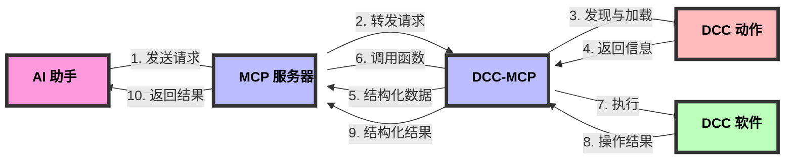

# DCC-MCP-Core

[](https://www.python.org/)
[](https://opensource.org/licenses/MIT)
[](http://makeapullrequest.com)
[](https://github.com/loonghao/dcc-mcp-core/actions)

[English](README.md) | [中文文档](README_zh.md)

DCC 模型上下文协议（Model Context Protocol，MCP）生态系统的基础库。它提供了在所有其他 DCC-MCP 包中使用的通用工具、基类和共享功能。

> **注意**：本项目处于早期开发阶段。API 可能会随时变化，我们不会提前发出通知。

## 设计理念与工作流程

DCC-MCP-Core 是一个为数字内容创建(DCC)应用程序设计的动作管理系统，旨在提供一个统一的接口，使 AI 能够与各种 DCC 软件（如 Maya、Blender、Houdini 等）进行交互。

### 核心工作流程

1. **MCP 服务器**：作为中央协调器，接收来自 AI 的请求
2. **DCC-MCP**：连接 MCP 服务器和具体的 DCC 软件
3. **动作发现与加载**：DCC-MCP-Core 负责发现、加载和管理动作
4. **结构化信息返回**：以 AI 友好的结构化格式将动作信息返回给 MCP 服务器
5. **函数调用与结果返回**：MCP 服务器调用相应的动作函数，并将结果返回给 AI



### 动作设计

动作采用简单直观的设计，使开发者能够轻松创建新的 DCC 功能：

- **元数据声明**：通过简单的变量定义动作的基本信息
- **函数定义**：实现特定的 DCC 操作功能
- **上下文传递**：通过上下文参数访问 DCC 软件的远程接口
- **结构化返回**：所有函数返回标准化的结构化数据

### 远程调用架构

DCC-MCP-Core 使用 RPyC 实现远程过程调用，允许在不同进程甚至不同机器上执行 DCC 操作：

- **上下文对象**：包含远程 DCC 客户端和命令接口
- **透明访问**：动作代码可以像访问本地 API 一样访问远程 DCC API
- **错误处理**：统一的错误处理机制确保稳定运行

## 包结构

DCC-MCP-Core 组织为几个子包：

- **actions**：动作管理和生成
  - `generator.py`：生成动作模板
  - `manager.py`：管理动作发现和加载
  - `metadata.py`：定义动作元数据结构

- **models**：MCP 生态系统的数据模型
  - `action_result.py`：动作的结构化结果模型

- **parameters**：参数处理和验证
  - `groups.py`：参数分组和依赖关系
  - `models.py`：参数数据模型
  - `processor.py`：参数处理工具
  - `validation.py`：参数验证逻辑

- **templates**：模板处理
  - `utils.py`：使用 Jinja2 进行模板渲染

- **utils**：实用函数和辅助工具
  - `constants.py`：通用常量
  - `decorators.py`：用于错误处理和结果格式化的函数装饰器
  - `exceptions.py`：异常层次结构
  - `platform.py`：平台特定工具
  - `template.py`：模板工具

## 功能特性

- 参数处理和验证
- 标准化日志系统
- 通用异常层次结构
- DCC 集成的实用函数
- 版本兼容性检查
- 用于 DCC 特定功能的动作管理系统
- AI 友好的结构化数据接口
- 通过 RPyC 支持远程过程调用

## 安装

```bash
pip install dcc-mcp-core
```

## 开发环境设置

```bash
# 克隆仓库
git clone https://github.com/loonghao/dcc-mcp-core.git
cd dcc-mcp-core

# 创建并激活虚拟环境
python -m venv venv
source venv/bin/activate  # Windows 上使用: venv\Scripts\activate

# 安装开发依赖
pip install -e .
pip install pytest pytest-cov pytest-mock pyfakefs
```

## 运行测试

```bash
# 运行带覆盖率的测试
uvx nox -s pytest

# 运行特定测试
python -m pytest tests/test_action_manager.py -v
```

## 使用示例

### 发现和加载动作

```python
from dcc_mcp_core.actions.manager import ActionManager

# 为 Maya 创建一个动作管理器
manager = ActionManager('maya')

# 发现可用的动作
actions_info = manager.get_actions_info()

# 打印可用动作的信息
for name, info in actions_info.items():
    print(f"动作: {name}")
    print(f"  版本: {info['version']}")
    print(f"  描述: {info['description']}")
    print(f"  函数: {len(info['functions'])}")

# 加载特定的动作
result = manager.load_action('/path/to/my_action.py')
if result.success:
    print(f"已加载动作: {result.context['action_name']}")
else:
    print(f"加载动作失败: {result.error}")

# 调用动作中的函数
result = manager.call_action_function('my_action', 'create_sphere', radius=2.0)
if result.success:
    print(f"成功: {result.message}")
    print(f"创建的对象: {result.context['object_name']}")
else:
    print(f"错误: {result.error}")
```

### 创建自定义动作

```python
# my_maya_action.py
__action_name__ = "my_maya_action"
__action_version__ = "1.0.0"
__action_description__ = "自定义 Maya 操作"
__action_author__ = "您的名字"

from dcc_mcp_core.models import ActionResultModel

def create_sphere(context, radius=1.0, name="sphere"):
    """在 Maya 中创建一个球体。

    参数:
        context: DCC 上下文对象
        radius: 球体的半径
        name: 球体的名称

    返回:
        包含结果信息的 ActionResultModel
    """
    try:
        # 通过上下文执行 Maya 命令
        sphere_name = context.cmds.sphere(radius=radius, name=name)[0]

        return ActionResultModel(
            success=True,
            message=f"成功创建球体 '{sphere_name}'",
            prompt="您现在可以修改球体的属性或创建更多对象",
            context={
                'object_name': sphere_name,
                'object_type': 'sphere',
                'properties': {'radius': radius}
            }
        )
    except Exception as e:
        return ActionResultModel(
            success=False,
            message="创建球体失败",
            error=str(e)
        )
```

## 贡献

欢迎贡献！请随时提交 Pull Request。

## 许可证

本项目采用 MIT 许可证 - 详情请参阅 LICENSE 文件。
