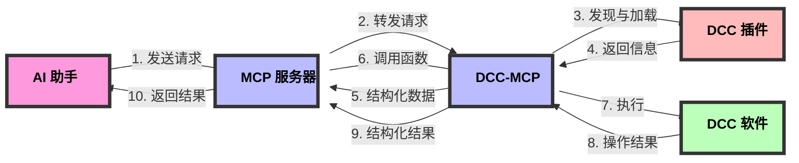

# dcc-mcp-core

DCC 模型上下文协议（Model Context Protocol，MCP）生态系统的基础库。它提供了在所有其他 DCC-MCP 包中使用的通用工具、基类和共享功能。

## 设计理念与工作流程

DCC-MCP-Core 是一个为数字内容创建(DCC)应用程序设计的插件管理系统，旨在提供一个统一的接口，使 AI 能够与各种 DCC 软件（如 Maya、Blender、Houdini 等）进行交互。

### 核心工作流程

1. **MCP 服务器**：作为中央协调器，接收来自 AI 的请求
2. **DCC-MCP**：连接 MCP 服务器和具体的 DCC 软件
3. **插件发现与加载**：DCC-MCP-Core 负责发现、加载和管理插件
4. **结构化信息返回**：将插件信息以 AI 友好的结构化格式返回给 MCP 服务器
5. **函数调用与结果返回**：MCP 服务器调用相应的插件函数，并将结果返回给 AI



### 插件设计

插件采用简单直观的设计，使开发者能够轻松创建新的 DCC 功能：

- **元数据声明**：通过简单的变量定义插件的基本信息
- **函数定义**：实现具体的 DCC 操作功能
- **上下文传递**：通过 context 参数获取 DCC 软件的远程接口
- **结构化返回**：所有函数返回标准化的结构化数据

### 远程调用架构

DCC-MCP-Core 使用 RPyC 实现远程过程调用，允许在不同进程甚至不同机器上执行 DCC 操作：

- **上下文对象**：包含远程 DCC 客户端和命令接口
- **透明访问**：插件代码可以像本地代码一样访问远程 DCC 的 API
- **错误处理**：统一的错误处理机制，确保稳定的操作

## 功能特性

- 参数处理和验证
- 标准化日志系统
- 通用异常层次结构
- DCC 集成的实用函数
- 版本兼容性检查
- 用于 DCC 特定功能的插件管理系统
- AI 友好的结构化数据接口
- 通过 RPyC 支持远程过程调用

## 系统要求

- Python 3.7+
- 兼容 Windows、macOS 和 Linux
- 设计为在 DCC 软件 Python 环境中工作

## 安装

```bash
pip install dcc-mcp-core
```

## 使用方法

### 基本用法

```python
from dcc_mcp_core import logging, parameters, exceptions

# 配置日志
logger = logging.get_logger("my_module")
logger.info("Starting operation")

# 处理参数
params = parameters.validate({"value": 10}, {"value": {"type": int, "required": True}})

# 处理异常
try:
    # 你的代码
    pass
except exceptions.MCPError as e:
    logger.error(f"Error occurred: {e}")
```

### 插件管理

插件管理系统允许您发现、加载和与 DCC 特定的插件交互：

```python
from dcc_mcp_core.plugin_manager import PluginManager

# 创建一个特定 DCC 的插件管理器
manager = PluginManager('maya')

# 发现可用的插件
plugin_paths = manager.discover_plugins()
print(f"Found {len(plugin_paths)} plugins for Maya")

# 加载所有发现的插件
plugins_info = manager.load_plugins(plugin_paths)
print(f"Loaded plugins: {list(plugins_info.keys())}")

# 获取插件的结构化信息（AI 友好格式）
plugins_info = manager.get_plugins_info()

# 调用特定插件的函数
result = manager.call_plugin_function('maya_scene_tools', 'create_primitive',
                                    context=context, primitive_type="cube", size=2.0)
```

### 创建自定义插件

创建一个具有以下结构的 Python 文件，使其可被插件系统发现：

```python
# my_maya_plugin.py

# 插件元数据
__plugin_name__ = "My Maya Plugin"
__plugin_version__ = "1.0.0"
__plugin_description__ = "A custom plugin for Maya"
__plugin_author__ = "Your Name"
__plugin_requires__ = ["maya"]

# 使用装饰器简化插件函数开发
from functools import wraps

def maya_tool(func):
    """将函数标记为 Maya 工具，自动处理 context 参数。"""
    @wraps(func)
    def wrapper(context, *args, **kwargs):
        # 从 context 中提取 Maya 客户端
        maya_client = context.get("maya_client")
        if not maya_client:
            return {"error": "Maya client not found"}

        # 调用原始函数
        try:
            return func(context, *args, **kwargs)
        except Exception as e:
            return {"status": "error", "message": str(e)}
    return wrapper

# 插件函数
@maya_tool
def create_cube(context, size=1.0, position=None):
    """在 Maya 中创建一个立方体。"""
    cmds = context.get("maya_client").cmds

    if position is None:
        position = [0, 0, 0]

    # 创建立方体
    cube = cmds.polyCube(w=size, h=size, d=size)[0]
    cmds.move(position[0], position[1], position[2], cube)

    return {
        "status": "success",
        "result": {
            "name": cube,
            "type": "cube",
            "size": size,
            "position": position
        }
    }
```

## 许可证

MIT
