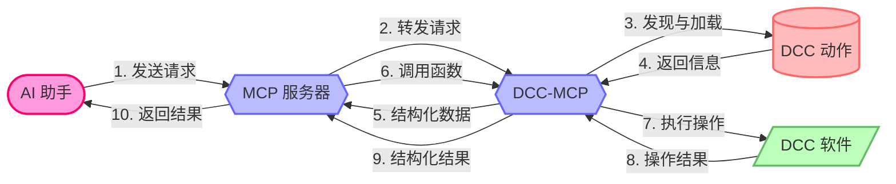

# DCC-MCP-Core

[](https://pypi.org/project/dcc-mcp-core/)
[](https://www.python.org/)
[](https://opensource.org/licenses/MIT)
[](https://pepy.tech/project/dcc-mcp-core)
[](https://codecov.io/gh/loonghao/dcc-mcp-core)
[](https://github.com/loonghao/dcc-mcp-core/actions)
[](http://makeapullrequest.com)
[](https://github.com/loonghao/dcc-mcp-core/releases)

[English](README.md) | [中文文档](README_zh.md)

DCC 模型上下文协议（Model Context Protocol，MCP）生态系统的基础库。**Rust 驱动核心**（PyO3），**零 Python 运行时依赖**，提供动作注册表、结构化结果、事件系统、技能包/脚本注册、MCP 协议类型和平台工具函数，用于数字内容创建（DCC）应用（Maya、Blender、Houdini 等）。

> **注意**：本项目处于早期开发阶段。API 可能会随时变化，我们不会提前发出通知。

## 设计理念与工作流程

DCC-MCP-Core 是一个为数字内容创建（DCC）应用程序设计的动作管理系统，旨在提供一个统一的接口，使 AI 能够与各种 DCC 软件进行交互。

### 核心工作流程


```mermaid
flowchart LR
    AI([AI 助手]):::aiNode
    MCP{{MCP 服务器}}:::serverNode
    DCCMCP{{DCC-MCP}}:::serverNode
    Actions[(DCC 动作)]:::actionsNode
    DCC[/DCC 软件/]:::dccNode

    AI -->|1. 发送请求| MCP
    MCP -->|2. 转发请求| DCCMCP
    DCCMCP -->|3. 发现与加载| Actions
    Actions -->|4. 返回信息| DCCMCP
    DCCMCP -->|5. 结构化数据| MCP
    MCP -->|6. 调用函数| DCCMCP
    DCCMCP -->|7. 执行操作| DCC
    DCC -->|8. 操作结果| DCCMCP
    DCCMCP -->|9. 结构化结果| MCP
    MCP -->|10. 返回结果| AI

    classDef aiNode fill:#f9d,stroke:#f06,stroke-width:2px,color:#333
    classDef serverNode fill:#bbf,stroke:#66f,stroke-width:2px,color:#333
    classDef dccNode fill:#bfb,stroke:#6b6,stroke-width:2px,color:#333
    classDef actionsNode fill:#fbb,stroke:#f66,stroke-width:2px,color:#333
```

## 架构

DCC-MCP-Core 使用 Rust workspace，包含 5 个子 crate，编译为单个 Python 扩展模块 `dcc_mcp_core._core`：

```
dcc-mcp-core/                      # Rust workspace 根目录
├── src/lib.rs                     # PyO3 模块入口 → _core.pyd/.so
├── python/dcc_mcp_core/
│   ├── __init__.py                # Python 从 _core 重新导出
│   └── py.typed                   # PEP 561 标记
└── crates/
    ├── dcc-mcp-models/            # ActionResultModel, SkillMetadata
    ├── dcc-mcp-actions/           # ActionRegistry（DashMap）, EventBus（发布/订阅）
    ├── dcc-mcp-protocols/         # MCP 类型定义（Tools、Resources、Prompts）
    ├── dcc-mcp-skills/            # SKILL.md 扫描与加载
    └── dcc-mcp-utils/             # 文件系统、常量、类型包装器、日志
```

所有 Python 导入均来自顶层 `dcc_mcp_core` 包：

```python
from dcc_mcp_core import (
    ActionResultModel, ActionRegistry, EventBus,
    SkillScanner, SkillMetadata,
    ToolDefinition, ToolAnnotations,
    ResourceDefinition, ResourceTemplateDefinition,
    PromptArgument, PromptDefinition,
    success_result, error_result, from_exception, validate_action_result,
    get_config_dir, get_data_dir, get_log_dir, get_actions_dir, get_skills_dir,
    wrap_value, unwrap_value, unwrap_parameters,
    BooleanWrapper, IntWrapper, FloatWrapper, StringWrapper,
)
```

## 功能特性

- **Rust 驱动核心** — 所有核心逻辑使用 Rust 通过 PyO3 实现，极致性能
- **零 Python 依赖** — Python 3.8+ 无第三方运行时依赖
- **ActionRegistry** — 使用 DashMap 实现线程安全的动作注册与查询，无锁并发读取
- **ActionResultModel** — 结构化结果类型（success、message、prompt、error、context），含工厂函数
- **EventBus** — 线程安全的发布/订阅事件系统，实现组件间解耦通信
- **Skills 技能包** — 零代码将脚本（Python、MEL、MaxScript、BAT、Shell、PowerShell、JavaScript）注册为 MCP 工具
- **MCP 协议类型** — 完整的 [MCP 规范](https://modelcontextprotocol.io/specification/2025-11-25) 类型定义：Tools、Resources、Prompts
- **类型包装器** — RPyC 兼容的类型包装器（BooleanWrapper、IntWrapper、FloatWrapper、StringWrapper），确保远程调用类型安全
- **平台工具** — 跨平台文件系统路径、基于 Rust `tracing` 的日志和常量

## 快速上手

### ActionRegistry

```python
from dcc_mcp_core import ActionRegistry

registry = ActionRegistry()
registry.register(
    name="create_sphere",
    description="在 Maya 中创建球体",
    dcc="maya",
    tags=["geometry", "creation"],
    input_schema='{"type": "object", "properties": {"radius": {"type": "number"}}}',
)

# 查询动作
meta = registry.get_action("create_sphere", dcc_name="maya")
names = registry.list_actions_for_dcc("maya")
dccs = registry.get_all_dccs()
```

### ActionResultModel

```python
from dcc_mcp_core import success_result, error_result, from_exception

# 成功结果（带上下文）
result = success_result("已创建球体", prompt="修改属性", object_name="sphere1")
print(result.success)   # True
print(result.message)   # "已创建球体"
print(result.context)   # {"object_name": "sphere1"}

# 错误结果
error = error_result(
    "创建失败",
    "文件未找到: /bad/path",
    prompt="检查文件路径",
    possible_solutions=["检查文件是否存在"],
)

# 创建修改后的副本
with_err = result.with_error("出错了")
with_ctx = result.with_context(extra_data="value")
d = result.to_dict()
```

### EventBus 事件总线

```python
from dcc_mcp_core import EventBus

bus = EventBus()

def on_action_done(**kwargs):
    print(f"动作: {kwargs.get('action_name')}, 成功: {kwargs.get('success')}")

sub_id = bus.subscribe("action.completed", on_action_done)
bus.publish("action.completed", action_name="create_sphere", success=True)
bus.unsubscribe("action.completed", sub_id)
```

### Skills 技能包系统

将任何脚本零代码注册为 MCP 工具。直接复用 [OpenClaw Skills](https://docs.openclaw.ai/tools) 生态格式。

1. **创建 Skill 目录**，包含 `SKILL.md` 和 `scripts/`：

```
maya-geometry/
├── SKILL.md
├── scripts/
│   ├── create_sphere.py
│   ├── batch_rename.mel
│   └── export_fbx.bat
└── metadata/          # 可选
    ├── depends.md
    └── help.md
```

2. **编写 SKILL.md**（YAML frontmatter）：

```yaml
---
name: maya-geometry
description: "Maya 几何体创建和修改工具"
tools: ["Bash", "Read"]
tags: ["maya", "geometry"]
dcc: maya
version: "1.0.0"
---
# Maya Geometry Skill

使用这些工具在 Maya 中创建和修改几何体。
```

3. **设置环境变量**并扫描：

```bash
export DCC_MCP_SKILL_PATHS="/path/to/my-skills"
```

```python
from dcc_mcp_core import SkillScanner, scan_skill_paths, parse_skill_md

scanner = SkillScanner()
skill_dirs = scanner.scan(extra_paths=["/my/skills"], dcc_name="maya")

# 或使用便捷函数
skill_dirs = scan_skill_paths(extra_paths=["/my/skills"], dcc_name="maya")

# 解析特定技能包
metadata = parse_skill_md("/path/to/maya-geometry")
```

#### 支持的脚本类型

| 扩展名 | 类型 | 执行方式 |
|--------|------|----------|
| `.py` | Python | 通过系统 Python `subprocess` 执行 |
| `.mel` | MEL (Maya) | 通过 context 中的 DCC 适配器执行 |
| `.ms` | MaxScript | 通过 context 中的 DCC 适配器执行 |
| `.bat`, `.cmd` | Batch | `cmd /c` |
| `.sh`, `.bash` | Shell | `bash` |
| `.ps1` | PowerShell | `powershell -File` |
| `.js`, `.jsx` | JavaScript | `node` |
| `.vbs` | VBScript | `cscript` |

### MCP 协议类型

```python
from dcc_mcp_core import ToolDefinition, ToolAnnotations, ResourceDefinition, PromptDefinition

tool = ToolDefinition(
    name="create_sphere",
    description="创建球体",
    input_schema='{"type": "object", "properties": {"radius": {"type": "number"}}}',
)

annotations = ToolAnnotations(
    title="创建球体",
    read_only_hint=False,
    destructive_hint=False,
    idempotent_hint=True,
)

resource = ResourceDefinition(
    uri="scene://objects",
    name="场景对象",
    description="当前场景中的所有对象",
    mime_type="application/json",
)
```

### 类型包装器（RPyC）

```python
from dcc_mcp_core import wrap_value, unwrap_value, unwrap_parameters

wrapped = wrap_value(True)          # BooleanWrapper(True)
original = unwrap_value(wrapped)    # True

params = {"visible": wrap_value(True), "count": wrap_value(5)}
unwrapped = unwrap_parameters(params)  # {"visible": True, "count": 5}
```

## 安装

```bash
# 从 PyPI 安装
pip install dcc-mcp-core

# 或从源代码安装
git clone https://github.com/loonghao/dcc-mcp-core.git
cd dcc-mcp-core
pip install maturin
maturin develop --features python-bindings,abi3-py38
```

### 系统要求

- **Python**: >= 3.7（abi3 wheel 支持 3.8+）
- **Rust**: >= 1.75（从源码构建时需要）
- **依赖**: Python 3.8+ 零运行时依赖

## 开发环境设置

```bash
# 克隆仓库
git clone https://github.com/loonghao/dcc-mcp-core.git
cd dcc-mcp-core

# 创建并激活虚拟环境
python -m venv venv
source venv/bin/activate  # Windows 系统: venv\Scripts\activate

# 安装开发依赖
pip install -e ".[dev]"

# 安装开发工具（推荐使用 vx）
# 请参阅 https://github.com/loonghao/vx 安装 vx
vx just install
```

## 运行测试

```bash
# 运行测试并生成覆盖率报告
vx just test

# 运行特定测试
vx uvx nox -s pytest -- tests/test_models.py -v

# 运行代码风格检查
vx just lint

# 运行代码风格检查并自动修复
vx just lint-fix

# 运行 pre-commit 检查
vx just prek-all
```

## 文档

完整文档请访问 [loonghao.github.io/dcc-mcp-core](https://loonghao.github.io/dcc-mcp-core/zh/)。

- [什么是 DCC-MCP-Core?](https://loonghao.github.io/dcc-mcp-core/zh/guide/what-is-dcc-mcp-core)
- [快速开始](https://loonghao.github.io/dcc-mcp-core/zh/guide/getting-started)
- [Actions 与注册表](https://loonghao.github.io/dcc-mcp-core/zh/guide/actions)
- [事件系统](https://loonghao.github.io/dcc-mcp-core/zh/guide/events)
- [Skills 技能包](https://loonghao.github.io/dcc-mcp-core/zh/guide/skills)
- [MCP 协议](https://loonghao.github.io/dcc-mcp-core/zh/guide/protocols)
- [API 参考](https://loonghao.github.io/dcc-mcp-core/zh/api/models)

## 版本发布流程

本项目使用 [Release Please](https://github.com/googleapis/release-please) 自动化版本管理和发布。工作流程：

1. **开发**：从 `main` 创建分支，使用 [Conventional Commits](https://www.conventionalcommits.org/) 提交代码
2. **合并**：提交 PR 并合并到 `main`
3. **发布 PR**：Release Please 自动创建/更新发布 PR，包含版本号更新和 `CHANGELOG.md` 更新
4. **发布**：合并发布 PR 后，自动创建 GitHub Release 并发布到 PyPI

### 提交信息格式

| 前缀 | 描述 | 版本变更 |
|------|------|----------|
| `feat:` | 新功能 | Minor（`0.x.0`） |
| `fix:` | Bug 修复 | Patch（`0.0.x`） |
| `feat!:` 或 `BREAKING CHANGE:` | 破坏性变更 | Major（`x.0.0`） |
| `docs:` | 仅文档 | 不触发发布 |
| `chore:` | 维护 | 不触发发布 |
| `ci:` | CI/CD 变更 | 不触发发布 |
| `refactor:` | 代码重构 | 不触发发布 |
| `test:` | 添加测试 | 不触发发布 |

## 贡献

欢迎贡献！请随时提交 Pull Request。

### 开发工作流

1. Fork 仓库并克隆你的 fork
2. 创建功能分支：`git checkout -b feat/my-feature`
3. 按照以下编码规范进行开发
4. 运行测试和代码检查：
   ```bash
   vx just lint       # 代码风格检查
   vx just test       # 运行测试
   vx just prek-all   # 运行所有 pre-commit hooks
   ```
5. 使用 [Conventional Commits](https://www.conventionalcommits.org/) 格式提交
6. 推送并向 `main` 提交 Pull Request

### 编码规范

- **风格**：使用 `ruff` 和 `isort` 格式化代码（行长度：120）
- **类型注解**：所有公开 API 必须有类型注解
- **文档字符串**：所有公开模块、类和函数使用 Google 风格的 docstring
- **测试**：新功能必须包含测试；保持或提高覆盖率
- **导入**：使用分区注释（`Import built-in modules`、`Import third-party modules`、`Import local modules`）

## 许可证

本项目采用 MIT 许可证 - 详情请参阅 LICENSE 文件。
