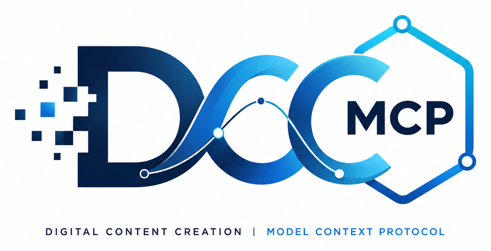
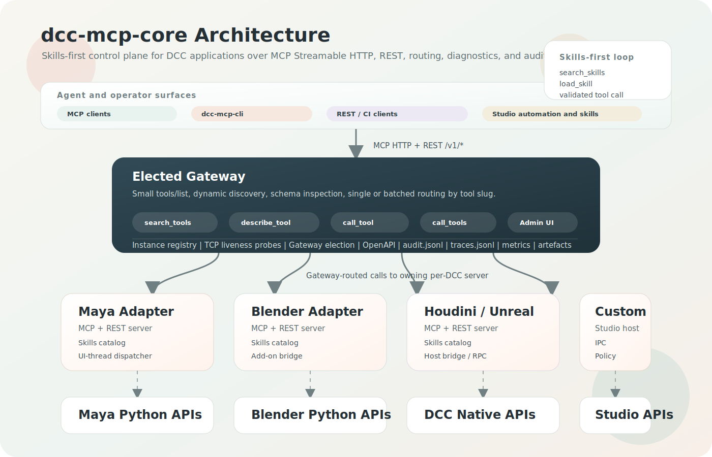
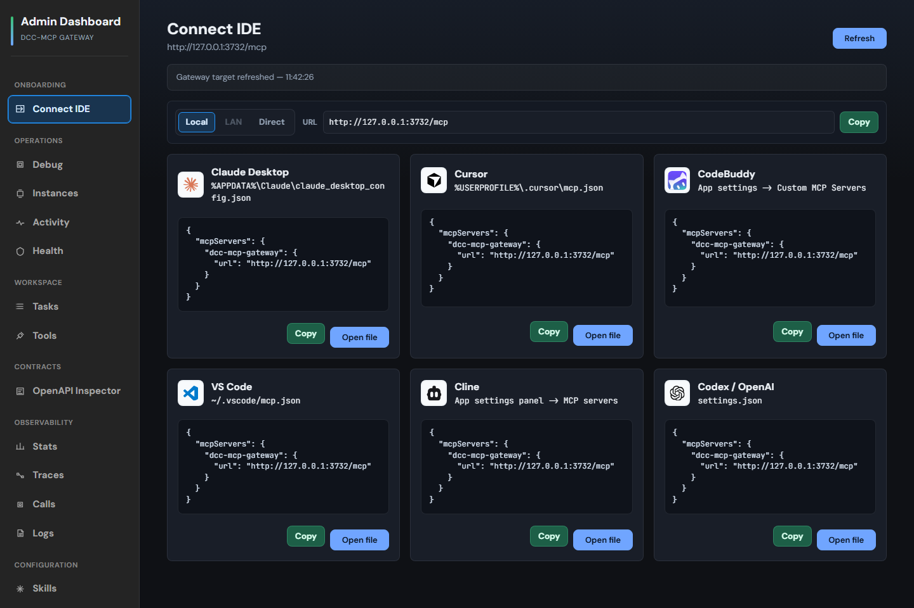
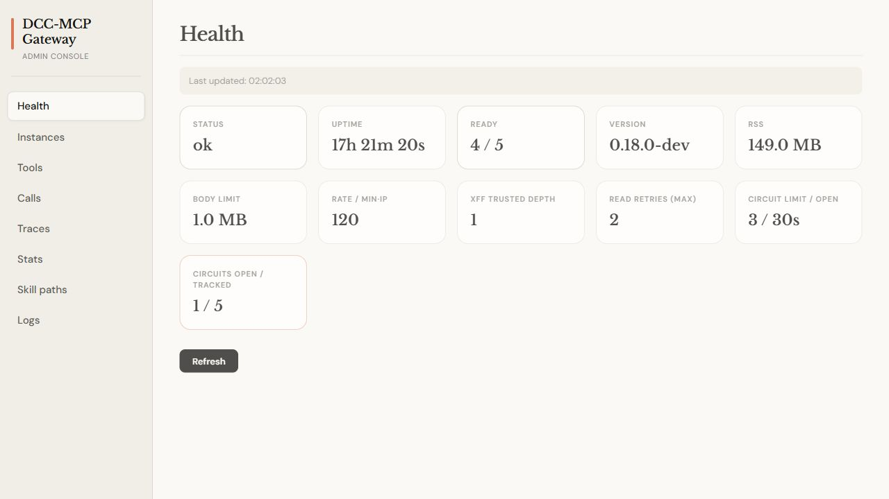
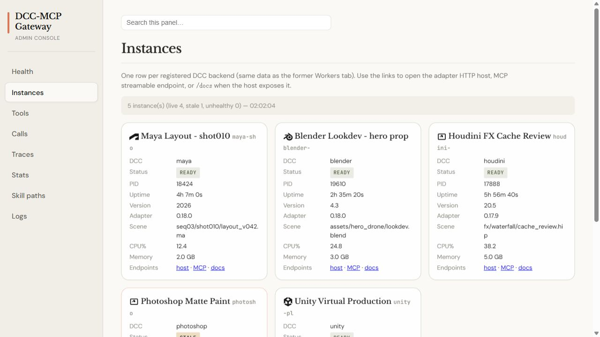
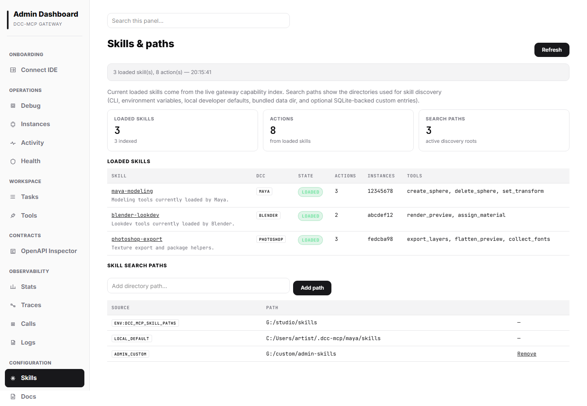
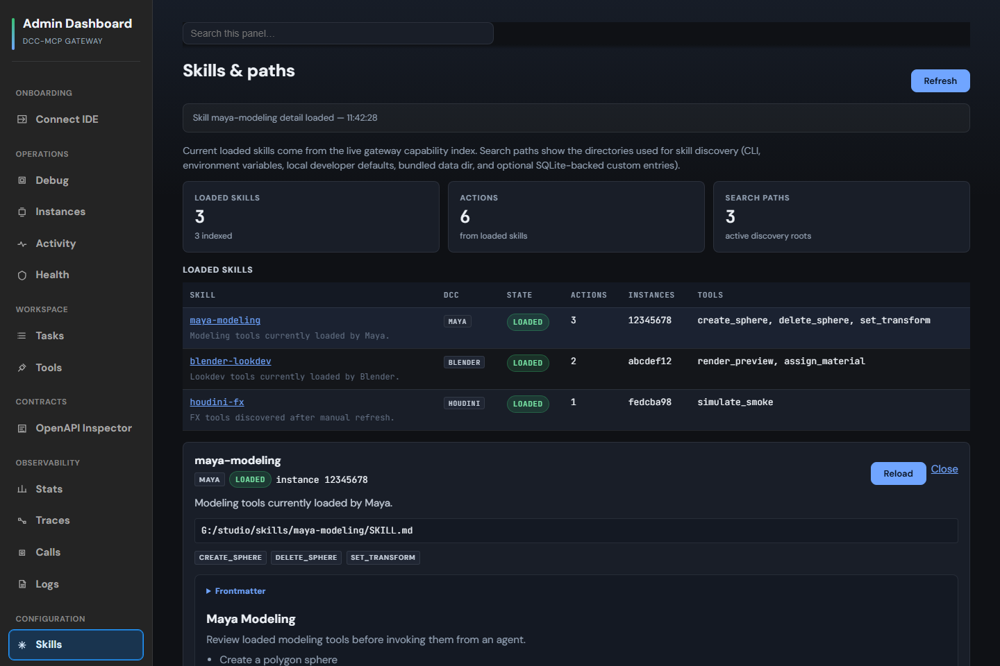
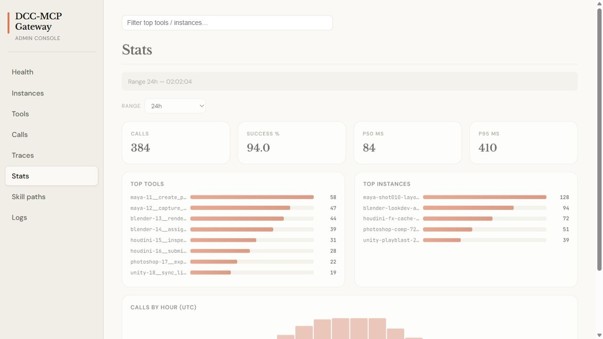
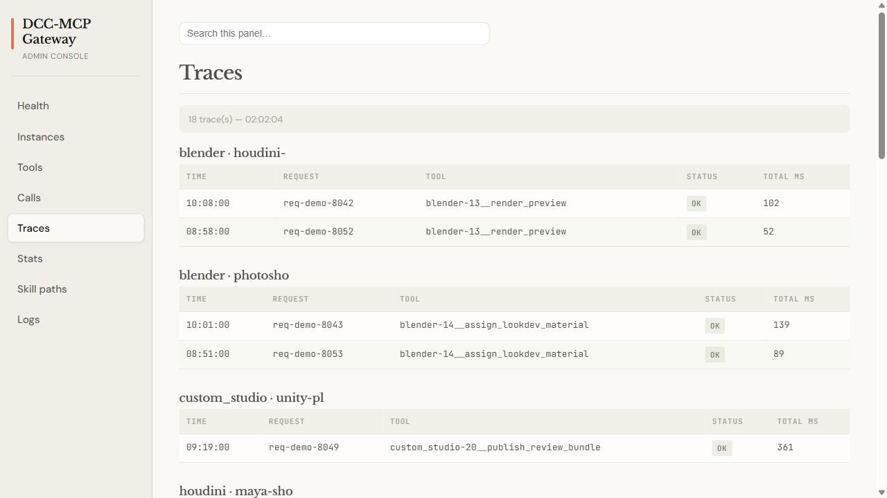

# dcc-mcp-core



[](https://pypi.org/project/dcc-mcp-core/)
[](https://pypi.org/project/dcc-mcp-server/)
[](https://www.python.org/)
[](https://opensource.org/licenses/MIT)
[](https://github.com/dcc-mcp/dcc-mcp-core/actions/workflows/ci.yml)
[](https://codecov.io/gh/dcc-mcp/dcc-mcp-core)
[](https://github.com/dcc-mcp/dcc-mcp-core/releases)
[](https://github.com/dcc-mcp/dcc-mcp-core/releases)
[](https://pypistats.org/packages/dcc-mcp-core)
[](https://pepy.tech/project/dcc-mcp-core)
[](https://pypistats.org/packages/dcc-mcp-server)
[](https://github.com/dcc-mcp/dcc-mcp-core/releases/latest)
[](https://github.com/dcc-mcp/dcc-mcp-core/releases/latest)
[](https://github.com/dcc-mcp/dcc-mcp-core/releases/latest)
[](http://makeapullrequest.com)

[English](README.md) | 中文

**Agent-first DCC 控制面：一个 CLI、一个 gateway，连接所有在线创作宿主。**

`dcc-mcp-core` 把 Maya、Blender、Houdini、Photoshop 和自定义工作室工具变成可发现、可路由的 MCP 端点。Agent 不再只能猜测 shell 输出，而是可以面对实时场景状态、受作用域约束的工具目录、结构化结果、视口诊断、审计日志，以及能适应真实生产约束的工作流。

默认 operator 路径是 `dcc-mcp-cli`：常规命令会在访问在线 DCC 会话之前确保本机 gateway 存在，Agent 和 CI 脚本不需要再维护脆弱的预启动步骤。同一套能力也驱动浏览器 Admin UI、marketplace skill 安装、包更新、Sentry/webhook/OTLP 集成设置，以及 traces、calls、logs、runtime health 等证据面板。

底层它结合 **MCP 2025-03-26 Streamable HTTP**、遵循 [agentskills.io 1.0](https://agentskills.io/specification) 的 **零代码 Skills 系统**，以及负责发现、路由、安装、lint、更新和运维的 Rust gateway。Python 包面向嵌入式 DCC 宿主保持**零第三方 Python 库依赖**，并依赖同套发布的 `dcc-mcp-server` wheel，确保 daemon-backed gateway 启动时即使 `PATH` 为空也有可用的打包二进制。独立的 `dcc-mcp-cli` 与 `dcc-mcp-server` 二进制也会随 GitHub Release 发布，适合像传统软件一样下载安装到工作站。支持 Python 3.7–3.14。

---

## 你能得到什么

| 需求 | dcc-mcp-core 提供 |
|---|---|
| 让 Agent 操作真实 DCC 会话 | 面向 Maya、Blender、Houdini、Photoshop 和自定义宿主的 MCP + REST 端点 |
| 控制工具上下文大小 | Gateway 发现流程：`search` -> `describe` -> `call`，不依赖巨大的第一页 `tools/list` |
| 从 Agent shell 可靠启动 | `dcc-mcp-cli health/list/search/...` 会在使用前自动确保 gateway |
| 不写框架胶水也能新增和更新工具 | `SKILL.md` + 同级 YAML / 脚本、marketplace 安装/更新，遵循 agentskills.io |
| 调试真实工作站状态 | Admin UI、视口诊断、审计日志、trace、logs、metrics、Sentry/webhook 集成状态 |
| 扛住生产约束 | 主线程调度、异步 job、sidecar/server 二进制、workflow 与 artefact 原语 |

## 产品入口

| 入口 | Operator 能看到什么 | 为什么重要 |
|---|---|---|
| `dcc-mcp-cli` | `health`、`list`、`search`、`describe`、`call`、`load-skill`、marketplace 和 update 命令 | Agent 与 CI 的默认入口；会自动检查并启动 gateway |
| Gateway Admin UI | 实例、server 版本、一键升级操作、skill 路径、marketplace 包、集成、calls、traces、logs 和健康状态 | 一个浏览器面板覆盖在线工作站运维 |
| Skills Marketplace | Catalog 搜索、安装、卸载、过期检查和包更新 | 团队可以分发 DCC 能力，而不必重建 adapter |
| Integrations | Sentry DSN、webhook 配置、企微消息推送、OTLP endpoint 可见性，以及 pending-restart 状态 | 可观测性设置来自真实 gateway API，不是静态说明，并会对密钥做掩码 |

## 运行时架构

这些进程和角色按下面的含义使用：

- **DCC startup hook** 运行在 Maya、Houdini、3ds Max 或其他宿主内部，只负责
  准备环境和启动 service 路径，不能阻塞 UI/main thread。
- **Per-DCC service** 是一个具体 DCC 实例对应的一条注册 runtime row。
- **Sidecar** 是通过 `dcc-mcp-server sidecar` 启动的 `dcc-mcp-sidecar` 子进
  程，负责把 host RPC 桥接到 MCP/REST，并监视 DCC 进程。
- **Gateway daemon** 是机器级唯一的路由/Admin 进程。
- **Guardian** 是 daemon-backed service 内部的轻量循环，探测 gateway
  `/health`，并通过 `gateway-launch.lock` 重新 ensure daemon。
- **Service heartbeat** 只负责保持 registry row 新鲜，不是 gateway 重启触
  发器。

理想插件体验是：打开 DCC -> startup hook 启动 per-DCC service/sidecar ->
service 确保 machine-wide gateway daemon 存在 -> 注册并 heartbeat 一个
instance row -> gateway 统一路由所有 live DCC instance。

## 快速开始

### 安装独立 CLI

如果你只需要 operator/CI 控制面，不想先准备 Python 环境，直接安装 release 二进制：

```bash
# Linux/macOS
curl -fsSL https://raw.githubusercontent.com/dcc-mcp/dcc-mcp-core/main/scripts/install-cli.sh | bash

# Windows PowerShell
powershell -c "irm https://raw.githubusercontent.com/dcc-mcp/dcc-mcp-core/main/scripts/install-cli.ps1 | iex"
```

安装后：

```bash
dcc-mcp-cli health
dcc-mcp-cli list
dcc-mcp-cli search --query "create sphere" --dcc-type maya --limit 20
dcc-mcp-cli describe <tool_slug>
dcc-mcp-cli call <tool_slug> --json '{"radius":2.0}'
dcc-mcp-cli marketplace search --query rigging --dcc maya --limit 20
dcc-mcp-cli update check --binary dcc-mcp-server --current-version <server_version>
```

默认操作流：

1. 先运行 `dcc-mcp-cli health` 或 `dcc-mcp-cli list`。对于本机 loopback
   gateway，常规 gateway-backed 命令会在 gateway 不存在时自动启动 daemon。
2. 如果 `list` 返回在线实例，再执行 `search -> describe -> call`；把
   `tools/list` 当作兼容性列表，不作为主要发现入口。
3. 打开 `http://127.0.0.1:9765/admin` 处理浏览器运维：实例健康、server
   版本检查、一键暂存 server 更新、skill 路径、marketplace 包更新、集成、
   traces、logs 和 Token 活动。
4. 对正在运行的 backend，使用 Instances 面板里的更新按钮暂存
   `dcc-mcp-server` 更新。`dcc-mcp-cli update apply` 只用于更新 CLI 二进制本身。

任意 gateway-backed 命令成功后，默认浏览器控制台可访问
`http://127.0.0.1:9765/admin`。如果 gateway 在其他地址，可以使用
`--base-url` 或 `DCC_MCP_BASE_URL` 指向它。

### 安装 Python core

```bash
pip install dcc-mcp-core
```

也可以用仓库的标准 feature set 从源码构建：

```bash
git clone https://github.com/dcc-mcp/dcc-mcp-core.git
cd dcc-mcp-core
vx just dev
```

### 以 Skills-First 方式暴露 DCC

`create_skill_server` 会接好渐进式发现、skill 加载、路由和结构化结果：

```python
from dcc_mcp_core import create_skill_server, McpHttpConfig

server = create_skill_server("maya", McpHttpConfig(port=8765))
handle = server.start()
print(handle.mcp_url())   # "http://127.0.0.1:8765/mcp"
```

Agent 可以在 per-DCC server 上使用 `search_skills` -> `load_skill`，也可以通过 gateway 使用 MCP `search` -> `describe`，再用 REST `POST /v1/call` 执行。

---

## 问题与解决方案

### 为什么不直接用 CLI？

**CLI 工具对 DCC 状态一无所知。** 它们无法看到当前场景、选中对象或视口内容，只能在隔离环境中执行，迫使 AI：

- 多次往返才能收集上下文
- 从 CLI 输出重建状态（脆弱、缓慢）
- 缺乏来自视口的视觉反馈
- 随请求增长上下文爆炸严重

### 为什么选 MCP（模型上下文协议）？

**MCP 是 AI 原生的**，但标准 MCP 在 DCC 自动化上缺两项关键能力：

1. **上下文爆炸** —— MCP 没有把工具限定到具体会话或实例的机制，多 DCC 场景下请求膨胀。
2. **无生命周期控制** —— 无法发现实例状态（活跃场景、文档、进程健康）或控制启动/关闭。

### 我们的方案：MCP + Skills 系统

我们**复用并扩展**现有 MCP 生态，新增：

| 能力 | 收益 |
|---|---|
| **网关选举与版本感知** | 多实例负载均衡；新 DCC 启动时自动接管 |
| **会话隔离** | 每个 AI 会话对接自己的 DCC 实例；避免上下文串扰 |
| **Skills 系统（零代码）** | 用 `SKILL.md` + 同级 YAML / 脚本定义工具，无需 Python 胶水 |
| **渐进式发现** | 按 DCC 类型、实例、场景、产品过滤工具；防止上下文爆炸 |
| **实例追踪** | 了解活跃文档、PID、显示名称；实现智能路由 |
| **结构化结果** | 每个工具返回 `(success, message, context, prompt)` 便于 AI 推理 |
| **Workflow 原语** | 声明式多步工作流：重试 / 超时 / 幂等键 / 审批闸门 |
| **Artefact 交接** | 基于内容寻址（SHA-256）在工具和工作流步骤间传递文件 |
| **Job 生命周期 + SSE** | `tools/call` 可选异步派发，`$/dcc.jobUpdated` 通知，SQLite 持久化 |

这不是重新发明 MCP —— 而是**解决 MCP 在桌面自动化中的盲点**。

---

## 为什么选 dcc-mcp-core？

| 方面 | dcc-mcp-core | 通用 MCP | CLI 工具 | 浏览器扩展 |
|---|---|---|---|---|
| **DCC 状态感知** | 场景、文档、实例 ID | 否 | 否 | 部分 |
| **多实例支持** | 网关选举 + 会话隔离 | 单端点 | 否 | 否 |
| **上下文限定** | 按 DCC / 场景 / 产品 | 全局工具 | 否 | 有限 |
| **零代码工具** | `SKILL.md` + 同级文件 | 需要完整 Python | 仅脚本 | 否 |
| **性能** | Rust + 零拷贝 + IPC | Python 开销 | 进程开销 | 网络开销 |
| **安全性** | 沙箱 + 审计日志 | 手动 | 手动 | 无 |
| **跨平台** | Windows / macOS / Linux | 是 | 有限 | 仅浏览器 |

AI 友好文档：[AGENTS.md](AGENTS.md) · [`docs/guide/agents-reference.md`](docs/guide/agents-reference.md) · [`.agents/skills/dcc-mcp-core/SKILL.md`](.agents/skills/dcc-mcp-core/SKILL.md)

---

## 架构：当前栈



### Gateway Admin UI

获选的 gateway 内置一套浏览器 admin 控制台，方便运维在不离开浏览器的情况下查看实时 DCC 会话、server 版本、路由健康、审计调用、traces、日志、skill 路径、marketplace 包、一键升级操作、集成设置和 Token 活动。下面的示例使用代表性演示数据，展示繁忙多 DCC 工作站上的主要面板。

Admin 重点能力：

- **Command Center**：区分 Agent 提示词交接和人类 CLI recipes；Agent 看到精简的 `search -> describe -> call` 路径，operator 仍然可以复制 `dcc-mcp-cli` 命令。CLI 命令会自动确保本机 gateway，不需要额外预启动步骤。
- **Instances**：使用列表式实例清单展示在线、过期、异常状态，同时显示 server 版本、adapter 版本、dispatch readiness、一键检查升级、直接升级按钮和暂存后的重启提示。
- **Skills 与 Marketplace**：使用列表优先的 skill inventory 管理自定义 skill 路径、已加载 skill 详情、marketplace 浏览/已安装/源标签、强制重装、包更新，并在包接口返回 HTML 而不是 JSON 时显示真实错误。
- **Integrations**：Sentry、webhooks、企微消息推送、OTLP 设置由 gateway API 支撑，可编辑保存到 `~/dcc-mcp/etc`，并在需要重启加载时显示 pending-restart 状态。企微消息模板可以填充 `$event`、`$dcc-type`、`$tool-slug`、`$url` 等事件字段。
- **证据面板**：calls、traces、logs、stats、health，以及类似 contribution calendar 的 Token 活动热力图，用于定位真实 Agent 活动。

浏览器 UI 使用的也是测试和自动化会调用的 Admin API：

| 面板 | 背后接口 |
|---|---|
| 实例与升级 | `GET /admin/api/instances`、`POST /admin/api/instances/{id}/update` |
| Skills 与 marketplace | `GET /admin/api/skill-paths`、`/admin/api/marketplace/*` |
| 集成设置 | `GET /admin/api/integrations`、`PUT /admin/api/integrations` |
| 分析与热力图 | `GET /admin/api/analytics/overview`、`/analytics/timeseries`、`/analytics/heatmap`、`/analytics/export` |
| 证据面板 | `GET /admin/api/calls`、`/traces`、`/logs`、`/health` |















---

## 安装详情与手动 API 示例

### 安装独立 CLI

如果你只需要 operator/CI 控制面，不想先准备 Python 环境，直接安装 release 二进制：

```bash
# Linux/macOS
curl -fsSL https://raw.githubusercontent.com/dcc-mcp/dcc-mcp-core/main/scripts/install-cli.sh | bash

# Windows PowerShell
powershell -c "irm https://raw.githubusercontent.com/dcc-mcp/dcc-mcp-core/main/scripts/install-cli.ps1 | iex"
```

默认会下载最新 GitHub Release 里的对应资产：

| 平台 | Asset |
|---|---|
| Linux x86_64 | `dcc-mcp-cli-linux-x86_64` |
| Windows x86_64 | `dcc-mcp-cli-windows-x86_64.exe` |
| macOS universal2 | `dcc-mcp-cli-macos-universal2` |

也可以固定版本或自定义安装目录：

```bash
export DCC_MCP_VERSION=v0.17.44
export DCC_MCP_INSTALL_DIR="$HOME/bin"
curl -fsSL https://raw.githubusercontent.com/dcc-mcp/dcc-mcp-core/main/scripts/install-cli.sh | bash
```

```powershell
$env:DCC_MCP_VERSION = "v0.17.44"
$env:DCC_MCP_INSTALL_DIR = "$env:USERPROFILE\bin"
irm https://raw.githubusercontent.com/dcc-mcp/dcc-mcp-core/main/scripts/install-cli.ps1 | iex
```

安装后：

```bash
dcc-mcp-cli health
dcc-mcp-cli list
dcc-mcp-cli search --query "create sphere" --dcc-type maya --limit 20
dcc-mcp-cli describe <tool_slug>
dcc-mcp-cli call <tool_slug> --json '{"radius":2.0}'
dcc-mcp-cli load-skill workflow --dcc-type 3dsmax --instance-id 80321760
dcc-mcp-cli marketplace install <package_name> --dcc maya
dcc-mcp-cli update check --binary dcc-mcp-server --current-version <server_version>
dcc-mcp-cli lint path/to/skills
```

默认浏览器控制台随后可访问 `http://127.0.0.1:9765/admin`。如果 gateway
运行在其他地址，请使用 `--base-url` 或 `DCC_MCP_BASE_URL`。

### 安装 Python core

```bash
# 从 PyPI 安装（Python 3.7+ 预构建 wheel）
pip install dcc-mcp-core

# 从源码构建（需要 Rust 1.95+）
git clone https://github.com/dcc-mcp/dcc-mcp-core.git
cd dcc-mcp-core
vx just dev           # 推荐 —— 使用项目标准 feature 集合
# 或：pip install -e .
```

每个 Release 都会附带 Linux、Windows、macOS universal2 的原生 `dcc-mcp-cli` 与 `dcc-mcp-server` 二进制。`dcc-mcp-server` 还会发布 `dcc-mcp-server` Python wheel，方便偏好 `pip install` 的宿主环境。

### 将 DCC 暴露为 MCP 服务 —— Skills-First（推荐）

`create_skill_server` 提供完整的 Skills-First 入口：`tools/list` 返回少量发现/生命周期工具加每个未加载 skill 的 stub，Agent 通过 `search_skills` → `load_skill` 激活实际需要的工具，让上下文窗口保持精简。

```python
from dcc_mcp_core import create_skill_server, McpHttpConfig

server = create_skill_server(
    "maya",
    McpHttpConfig(port=8765),
)
handle = server.start()
print(handle.mcp_url())   # "http://127.0.0.1:8765/mcp"
# ... 其他逻辑 ...
handle.shutdown()
```

### 底层 API：手动注册工具

```python
import json
from dcc_mcp_core import (
    ToolRegistry, ToolDispatcher, EventBus,
    McpHttpServer, McpHttpConfig,
    success_result, scan_and_load,
)

skills, skipped = scan_and_load(dcc_name="maya")
print(f"加载 {len(skills)} 个 skills，跳过 {len(skipped)} 个")

registry = ToolRegistry()
registry.register(
    name="get_scene",
    description="返回当前 Maya 场景路径",
    category="scene",
    dcc="maya",
    version="1.0.0",
)

dispatcher = ToolDispatcher(registry)
dispatcher.register_handler(
    "get_scene",
    lambda params: success_result("OK", path="/proj/shots/sh010.ma").to_dict(),
)

# 可选：观察生命周期事件
bus = EventBus()
bus.subscribe("action.after_execute", lambda **kw: print(f"完成：{kw['action_name']}"))

result = dispatcher.dispatch("get_scene", json.dumps({}))
print(result["output"])   # {"success": True, "message": "OK", "context": {"path": ...}}

# 通过 MCP 暴露注册表（必须在 .start() 之前注册所有 handler）
server = McpHttpServer(registry, McpHttpConfig(port=8765))
handle = server.start()
```

---

## 核心概念

### ToolResult —— 面向 AI 的结构化结果

所有 skill 执行结果都使用 `ToolResult`，它专为 AI 友好而设计，带结构化上下文和后续建议。

```python
from dcc_mcp_core import ToolResult, success_result, error_result

# 工厂函数（推荐）。额外 kwargs 放入 context。
ok = success_result(
    "球体已创建",
    prompt="接下来可以添加材质或调整 UV",
    object_name="sphere1",
    position=[0, 1, 0],
)
# ok.context == {"object_name": "sphere1", "position": [0, 1, 0]}

err = error_result(
    "创建球体失败",
    "半径必须为正数",
)

# 直接构造
result = ToolResult(
    success=True,
    message="操作完成",
    context={"key": "value"},
)

result.success   # bool
result.message   # str
result.prompt    # Optional[str] —— AI 下一步建议
result.error     # Optional[str] —— 错误详情
result.context   # dict —— 任意结构化数据
result.to_json() # JSON 安全序列化
```

### ToolRegistry 与 Dispatcher

```python
import json
from dcc_mcp_core import ToolRegistry, ToolDispatcher, EventBus

registry = ToolRegistry()
registry.register(name="my_tool", description="我的工具", category="tools", version="1.0.0")

dispatcher = ToolDispatcher(registry)
dispatcher.register_handler("my_tool", lambda params: {"done": True})

result = dispatcher.dispatch("my_tool", json.dumps({}))
# result == {"action": "my_tool", "output": {"done": True}, "validation_skipped": True}

bus = EventBus()
sub_id = bus.subscribe("action.before_execute", lambda **kw: print(f"before: {kw}"))
bus.publish("action.before_execute", action_name="test")
bus.unsubscribe("action.before_execute", sub_id)
```

---

## Skills 系统 —— 零代码 MCP 工具注册

Skills 系统允许你把任何脚本（Python、MEL、MaxScript、Batch、Shell、PowerShell、JavaScript、TypeScript）注册为 MCP 工具，**完全不写 Python 胶水代码**。对齐 [agentskills.io 1.0](https://agentskills.io/specification) 规范。

### 架构规则 —— 同级文件模式（v0.15+）

dcc-mcp-core 的每一项扩展（`tools`、`groups`、`workflows`、`prompts`、`next-tools` 等）都以 `metadata.dcc-mcp.<feature>` 键指向**同级文件**。`SKILL.md` frontmatter 本身只保留六个标准 agentskills.io 字段（`name`、`description`、`license`、`compatibility`、`metadata`、`allowed-tools`）。

```
my-automation/
├── SKILL.md                      # frontmatter + 人类可读正文
├── tools.yaml                    # 工具定义 + annotations + groups
├── workflows/
│   └── vendor_intake.workflow.yaml
├── prompts/
│   └── review_scene.prompt.yaml
└── scripts/
    ├── cleanup.py
    └── publish.sh
```

### 五分钟上手你的第一个 Skill

**1. 创建 `maya-cleanup/SKILL.md`：**

```yaml
---
name: maya-cleanup
description: >-
  Domain skill —— Maya 场景优化与清理工具。
  不用于新建几何体 —— 请改用 maya-geometry。
license: MIT
compatibility: "Maya 2024+, Python 3.7+"
metadata:
  dcc-mcp:
    layer: domain
    dcc: maya
    tools: tools.yaml
    search-hint: "cleanup, optimise, unused nodes"
    depends: [dcc-diagnostics]
---
# Maya 场景清理

自动化工具用于优化和校验 Maya 场景。
```

**2. 创建 `maya-cleanup/tools.yaml`：**

```yaml
tools:
  - name: cleanup
    description: "清理活跃场景中的未使用节点。"
    source_file: scripts/cleanup.py
    execution: sync
    affinity: main
    annotations:
      read_only_hint: false
      destructive_hint: true
      idempotent_hint: true
    next-tools:
      on-success: [maya_cleanup__validate]
      on-failure: [dcc_diagnostics__screenshot, dcc_diagnostics__audit_log]

  - name: validate
    description: "清理后校验场景完整性。"
    source_file: scripts/validate.mel
    execution: sync
    affinity: main
    annotations:
      read_only_hint: true
```

**3. 创建 `maya-cleanup/scripts/cleanup.py`：**

```python
#!/usr/bin/env python
"""清理场景中的未使用节点。"""
from __future__ import annotations

import json
import sys


def main() -> int:
    result = {"success": True, "message": "清理了 42 个未使用节点"}
    print(json.dumps(result))
    return 0


if __name__ == "__main__":
    sys.exit(main())
```

**4. 注册并调用：**

```python
import os
os.environ["DCC_MCP_SKILL_PATHS"] = "/path/to/maya-cleanup/.."

from dcc_mcp_core import create_skill_server, McpHttpConfig

server = create_skill_server("maya", McpHttpConfig(port=8765))
handle = server.start()
# Agent 调用 search_skills("cleanup") → load_skill("maya-cleanup") → maya_cleanup__cleanup
```

就这么简单 —— 零 Python 胶水代码，只要 `SKILL.md` + `tools.yaml` + 脚本。

### 支持的脚本类型

| 扩展名 | 类型 | 执行方式 |
|---|---|---|
| `.py` | Python | 通过系统 Python `subprocess` |
| `.mel` | MEL (Maya) | 通过 DCC 适配器 |
| `.ms` | MaxScript | 通过 DCC 适配器 |
| `.bat`, `.cmd` | Batch | `cmd /c` |
| `.sh`, `.bash` | bashell | `bash` |
| `.ps1` | PowerShell | `powershell -File` |
| `.js`, `.jsx` | JavaScript | `node` |
| `.ts` | TypeScript | `node`（通过 ts-node 或 tsx） |

完整示例请看 [`examples/skills/`](examples/skills/)。

### 内置 Skills —— 零配置开箱即用

`dcc-mcp-core` wheel 内置 **两个核心 skills**，`pip install dcc-mcp-core` 后立即可用，无需克隆仓库或配置 `DCC_MCP_SKILL_PATHS`。

| Skill | 工具 | 用途 |
|---|---|---|
| `dcc-diagnostics` | `screenshot`、`audit_log`、`tool_metrics`、`process_status` | 任意 DCC 的可观测性与调试 |
| `workflow` | `run_chain` | 多步 action 串联，上下文透传 |

```python
from dcc_mcp_core import get_bundled_skills_dir, get_bundled_skill_paths

print(get_bundled_skills_dir())
# /path/to/site-packages/dcc_mcp_core/skills

paths = get_bundled_skill_paths()                       # 默认开启
paths = get_bundled_skill_paths(include_bundled=False)  # 显式关闭
```

DCC 适配器（如 `dcc-mcp-maya`）默认包含内置 skills。关闭：`start_server(include_bundled=False)`。

---

## 解决 MCP 上下文爆炸

**问题**：标准 MCP 在 `tools/list` 里返回*所有*工具，连跟当前任务/实例无关的也一起。3 个 DCC 实例 × 50 个 skills × 5 个脚本 = **750 个工具**，上下文窗口瞬间爆满。

**渐进式发现** —— dcc-mcp-core 把这个数字压到 Agent 实际需要的量级：

1. **Skill stubs** —— 直连单个 DCC 时，`tools/list` 只返回发现/生命周期元工具 + 每个未加载 skill 一个 stub（`__skill__<name>`）。Agent 调用 `search_skills(query)` → `load_skill(name)` 才激活真正的工具；连接网关时，`tools/list` 保持为 search/describe/call 包装器，实例/诊断视图通过 `gateway://instances` / `gateway://diagnostics/*` resources 读取。
2. **实例感知** —— 每个 DCC 注册活跃文档、PID、显示名、作用域。
3. **工具作用域过滤** —— 按 DCC 类型、信任作用域（Repo < User < System < Admin）、产品白名单和策略过滤。
4. **会话隔离** —— AI 会话固定到一个 DCC 实例，只看到该实例的工具。
5. **网关选举** —— 新版本 DCC 启动时自动接管流量。

标准 MCP：

```
tools/list 响应：
  100 Maya + 100 Houdini + 100 Blender + 250 共享 = 550 个工具定义
```

dcc-mcp-core (Skills-First)：

```
tools/list 响应（Maya 会话、尚未加载任何 skill）：
  少量核心工具 + 22 个 skill stub
→ Agent 只加载需要的 3 个 skill → 上下文约 ~30 个工具
```

---

## 能力亮点

- **Rust 驱动性能** —— 零拷贝序列化（`rmp-serde`）、LZ4 共享内存、无锁数据结构。
- **零第三方 Python 库依赖** —— 核心逻辑编译进原生扩展；配套 `dcc-mcp-server` wheel 提供 gateway daemon 二进制。
- **Skills-First MCP 服务器** —— `create_skill_server()` 提供开箱即用的 MCP 2025-03-26 Streamable HTTP 端点，内置渐进式发现。
- **Workflow 原语** —— `WorkflowSpec` / `WorkflowExecutor`：声明式多步工作流，支持重试、超时、幂等键、审批闸门、foreach / parallel / branch 步骤、SQLite 恢复。
- **调度器** —— Cron + Webhook（HMAC-SHA256）触发的工作流，通过同级 `schedules.yaml`（可选 feature）。
- **Artefact 交接** —— 基于内容寻址（SHA-256）的 `FileRef` + `ArtefactStore`，在工具和工作流步骤间传递文件。
- **Job 生命周期与通知** —— 可选异步 `tools/call`、SSE 通道（`notifications/progress`、`$/dcc.jobUpdated`、`$/dcc.workflowUpdated`）、可选 SQLite 持久化（重启保活）。
- **Resources / Prompts 原语** —— 暴露 DCC 实时状态（`scene://current`、`capture://current_window`、`audit://recent`、`artefact://sha256/<hex>`）与同级 YAML 里的可复用 prompt 模板。
- **线程亲和** —— `DeferredExecutor` 安全地把主线程工具派发到 DCC 事件循环；其余由 Tokio 工作线程处理。
- **网关与多实例** —— 版本感知先到先得选举、会话间 SSE 多路复用、异步派发 + wait-for-terminal 透传。
- **鲁棒 IPC** —— 基于 `ipckit` 的 DccLink 帧协议（Named Pipe / Unix Socket）：`IpcChannelAdapter`、`GracefulIpcChannelAdapter`、`SocketServerAdapter`。
- **进程管理** —— 启动、监控、自动恢复 DCC 进程。
- **沙箱安全** —— 基于策略的访问控制 + 审计日志、`ToolAnnotations` 安全提示、`ToolValidator` schema 校验。
- **屏幕捕获** —— 全屏或单窗口（HWND `PrintWindow`）视口捕获，供 AI 视觉反馈。
- **USD 集成** —— Universal Scene Description 读写桥。
- **结构化遥测** —— 追踪、录制，可选 Prometheus `/metrics` 导出器。
- **380+ 个公开 Python 符号** —— 通过顶层重导出提供；`_core.pyi` 是 stub-gen/dev 构建后的生成产物，不是手写源码。

---

## 架构总览 —— 41 个 Workspace 包

`dcc-mcp-core` 组织为 **41 个包的 Rust workspace**（40 个功能包 + `workspace-hack`）。大多数库 crate 通过 PyO3 / maturin 编译进原生 Python 扩展（`_core`），`dcc-mcp-cli`、`dcc-mcp-server` 与 tunnel 二进制也会作为面向用户的 release assets 发布。根 `Cargo.toml` 是 workspace 成员列表的唯一来源。精选 crate：

| Crate | 职责 | 关键类型 |
|---|---|---|
| `dcc-mcp-naming` | SEP-986 命名校验 | `validate_tool_name`、`validate_action_id`、`TOOL_NAME_RE` |
| `dcc-mcp-models` | 数据模型 | `ToolResult`、`SkillMetadata`、`ToolDeclaration` |
| `dcc-mcp-actions` | 工具执行生命周期 | `ToolRegistry`、`ToolDispatcher`、`ToolValidator`、`ToolPipeline`、`EventBus` |
| `dcc-mcp-skills` | Skills 发现与加载 | `SkillScanner`、`SkillCatalog`、`SkillWatcher`、依赖解析器 |
| `dcc-mcp-protocols` | MCP 协议类型 | `ToolDefinition`、`ResourceDefinition`、`PromptDefinition`、`ToolAnnotations`、`BridgeKind` |
| `dcc-mcp-jsonrpc` | MCP JSON-RPC 线协议 | `JsonRpcRequest`、`JsonRpcResponse`、notifications |
| `dcc-mcp-job` | 异步 Job 追踪 | `JobManager`、持久化 trait |
| `dcc-mcp-skill-rest` | per-DCC REST skill API | `SkillRestService`、`SkillRestConfig`、`/v1/*` router |
| `dcc-mcp-gateway-core` | 纯 gateway 领域层 | `CapabilityRecord`、`SearchQuery`、`SearchHit`、ranking scorers、slug helpers |
| `dcc-mcp-gateway` | 多 DCC 网关应用/基础设施 | registry probe、MCP `search` / `describe`、REST `/v1/*` facade |
| `dcc-mcp-http-types` | 纯 HTTP 线协议/配置/值类型 | `HttpError`、`JobConfig`、`InstanceConfig`、`PromptSpec`、`ProducerContent`、`SessionLogMessage` |
| `dcc-mcp-http-server` | 可复用 HTTP 运行时支撑层 | core tool builders、executor、sessions、in-flight requests、notifications、workspace roots |
| `dcc-mcp-catalog` | 公开适配器目录 | catalog search / describe CLI 与 MCP tools |
| `dcc-mcp-transport` | IPC 通信 | `DccLinkFrame`、`IpcChannelAdapter`、`GracefulIpcChannelAdapter`、`SocketServerAdapter`、`FileRegistry` |
| `dcc-mcp-process` | 进程管理 | `PyDccLauncher`、`PyProcessMonitor`、`PyProcessWatcher`、`PyCrashRecoveryPolicy`、`HostDispatcher` |
| `dcc-mcp-sandbox` | 安全 | `SandboxPolicy`、`SandboxContext`、`InputValidator`、`AuditLog` |
| `dcc-mcp-shm` | 共享内存 | `PySharedBuffer`、`PySharedSceneBuffer`、LZ4 压缩 |
| `dcc-mcp-capture` | 屏幕捕获 | `Capturer`、`WindowFinder`、HWND / DXGI / X11 / Mock 后端 |
| `dcc-mcp-telemetry` | 可观测性 | `TelemetryConfig`、`ToolRecorder`、`ToolMetrics`、可选 Prometheus |
| `dcc-mcp-usd` | USD 集成 | `UsdStage`、`UsdPrim`、`scene_info_json_to_stage` |
| `dcc-mcp-http` | MCP Streamable HTTP facade | `McpHttpServer`、`McpHttpConfig`、`McpServerHandle`、PyO3 bindings、兼容重导出 |
| `dcc-mcp-cli` | 客户端控制面 CLI | `dcc-mcp-cli list/search/describe/call/install` |
| `dcc-mcp-server` | 二进制入口 | `dcc-mcp-server` CLI、网关 runner |
| `dcc-mcp-workflow` | 工作流引擎（可选） | `WorkflowSpec`、`WorkflowExecutor`、`WorkflowHost`、`StepPolicy`、`RetryPolicy` |
| `dcc-mcp-scheduler` | Cron + Webhook 调度器（可选） | `ScheduleSpec`、`TriggerSpec`、`SchedulerService`、HMAC 校验 |
| `dcc-mcp-artefact` | 内容寻址 artefact 存储 | `FileRef`、`FilesystemArtefactStore`、`InMemoryArtefactStore` |
| `dcc-mcp-logging` | 滚动文件日志 | `FileLoggingConfig`、日志保留辅助函数 |
| `dcc-mcp-paths` | 平台路径辅助 | cache/config/data 目录辅助函数 |
| `dcc-mcp-pybridge` | PyO3 桥接辅助 | repr/to-dict 宏、JSON/YAML bridge |
| `dcc-mcp-host` | Host execution bridge | 面向 adapter 的执行契约 |
| `dcc-mcp-tunnel-*` | Remote MCP relay | tunnel protocol、relay、本地 agent |

---

## 精选 API

### 传输层 —— 进程间通信

```python
from dcc_mcp_core import DccLinkFrame, IpcChannelAdapter, SocketServerAdapter

# 服务端：创建通道并等待客户端
server = IpcChannelAdapter.create("dcc-mcp-maya")
server.wait_for_client()

# 客户端：连接服务端
client = IpcChannelAdapter.connect("dcc-mcp-maya")
client.send_frame(DccLinkFrame(msg_type="Call", seq=1, body=b'{"method":"ping"}'))
reply = client.recv_frame()      # DccLinkFrame(msg_type, seq, body)

# 多客户端 socket 服务器（给 bridge 模式 DCC 使用）
sock_server = SocketServerAdapter("/tmp/dcc-mcp.sock",
                                  max_connections=10,
                                  connection_timeout_secs=30)
```

### 进程管理 —— DCC 生命周期控制

```python
from dcc_mcp_core import (
    PyDccLauncher, PyProcessMonitor, PyProcessWatcher, PyCrashRecoveryPolicy,
)

launcher = PyDccLauncher(dcc_type="maya", version="2025")
process = launcher.launch(
    script_path="/path/to/startup.py",
    working_dir="/project",
    env_vars={"MAYA_RENDER_THREADS": "4"},
)

monitor = PyProcessMonitor()
monitor.track(process)
stats = monitor.stats(process)     # CPU、内存、uptime

watcher = PyProcessWatcher(
    recovery_policy=PyCrashRecoveryPolicy(max_restarts=3, cooldown_sec=10),
)
watcher.watch(process)
```

### 沙箱安全 —— 基于策略的访问控制

```python
from dcc_mcp_core import SandboxContext, SandboxPolicy, InputValidator

policy = SandboxPolicy()
ctx = SandboxContext(policy)
validator = InputValidator(ctx)

allowed, reason = validator.validate("delete_all_files")
if not allowed:
    print(f"被策略阻止：{reason}")

# 审计日志
for entry in ctx.audit_log.entries():
    print(f"{entry.action} -> {entry.outcome}")
```

### 工作流与 Artefact 交接 (v0.14+)

```python
from dcc_mcp_core import (
    WorkflowSpec, BackoffKind,
    artefact_put_bytes, artefact_get_bytes,
)

spec = WorkflowSpec.from_yaml_str(yaml_text)
spec.validate()                    # 静态 idempotency_key + 模板引用检查
print(spec.steps[0].policy.retry.next_delay_ms(2))

ref = artefact_put_bytes(b"hello", mime="text/plain")
print(ref.uri)                     # "artefact://sha256/<hex>"
assert artefact_get_bytes(ref.uri) == b"hello"
```

完整 feature 矩阵和决策树请看 [AGENTS.md](AGENTS.md)。

---

## 开发环境

```bash
git clone https://github.com/dcc-mcp/dcc-mcp-core.git
cd dcc-mcp-core

# 推荐：使用 vx（通用开发工具管理器）—— https://github.com/loonghao/vx
vx just dev            # 编译 + 安装 dev wheel（使用项目标准 feature 集合）
vx just test           # 运行 Python 测试
vx just test-rust      # 运行 Rust 单元/集成测试
vx just lint           # 完整 lint 检查（Rust + Python）
vx just preflight      # 预提交检查（cargo check + clippy + fmt + test-rust）
vx just ci             # 完整本地 CI pipeline
```

### 不使用 `vx`

```bash
python -m venv venv
source venv/bin/activate   # Windows：venv\Scripts\activate
pip install maturin pytest pytest-cov ruff mypy

# feature 列表的唯一真实源在根 justfile —— 看 `just print-dev-features`
maturin develop --features "$(just print-dev-features)"
pytest tests/ -v
ruff check python/ tests/ examples/
cargo clippy --workspace -- -D warnings
```

feature 列表的**唯一真实源在 `justfile`**（`OPT_FEATURES`、`DEV_FEATURES`、`WHEEL_FEATURES`、`WHEEL_FEATURES_PY37`）。CI、本地开发、发布 wheel 都从同一处读取。

---

## 发版流程

本项目使用 [Release Please](https://github.com/googleapis/release-please) 自动化版本与发版：

1. **开发**：从 `main` 拉分支，使用 [Conventional Commits](https://www.conventionalcommits.org/) 提交。
2. **合并**：开 PR，合入 `main`。
3. **发布 PR**：Release Please 自动创建 / 更新一个发布 PR，升版本并更新 `CHANGELOG.md`。
4. **发布**：发布 PR 合入后，自动创建 GitHub Release，附带 `dcc-mcp-cli` 与 `dcc-mcp-server` 二进制；`dcc-mcp-core` wheels 发布到 PyPI；`dcc-mcp-server` wheels 在 trusted publisher 配好后同步上传。

### 提交信息格式

| 前缀 | 描述 | 版本升级 |
|---|---|---|
| `feat:` | 新特性 | Minor (`0.x.0`) |
| `fix:` | Bug 修复 | Patch (`0.0.x`) |
| `feat!:` / `BREAKING CHANGE:` | 破坏性变更 | Major (`x.0.0`) |
| `docs:` | 仅文档 | 无发版 |
| `chore:` | 杂务 | 无发版 |
| `ci:` | CI/CD 变更 | 无发版 |
| `refactor:` | 代码重构 | 无发版 |
| `test:` | 测试相关 | 无发版 |
| `build:` | 构建系统 / 依赖变更 | 无发版 |

```bash
git commit -m "feat: add batch skill execution support"
git commit -m "fix: resolve middleware chain ordering issue"
git commit -m "feat!: redesign skill registry API"
git commit -m "feat(skills): add PowerShell script support"
git commit -m "docs: update API reference"
```

---

## 贡献

欢迎贡献 —— 请提 Pull Request。

1. Fork 仓库并克隆到本地。
2. 创建特性分支：`git checkout -b feat/my-feature`。
3. 按照下面的编码规范修改代码。
4. 运行测试与 lint：
   ```bash
   vx just lint        # 代码风格检查
   vx just test        # 运行测试
   vx just preflight   # 所有预提交检查
   ```
5. 使用 [Conventional Commits](https://www.conventionalcommits.org/) 格式提交。
6. 推送并基于 `main` 发起 Pull Request。

### 编码规范

- **风格**：Rust 用 `cargo fmt`，Python 用 `ruff format`（行宽 120、双引号）。
- **类型注解**：所有公开 Python API 必须有类型注解；Rust 用 `thiserror` 做错误、`tracing` 做日志。
- **Docstring**：所有公开模块、类、函数使用 Google 风格 docstring。
- **测试**：新特性必须带测试；保持或提升覆盖率。
- **导入顺序（Python）**：首行 `from __future__ import annotations`，然后 stdlib → 第三方 → 本地，并用段落注释分隔。

---

## 许可证

MIT —— 详情见 [LICENSE](LICENSE)。

---

## AI Agent 资源

如果你是 AI 编码 Agent，同时请阅读：

- [AGENTS.md](AGENTS.md) —— AI Agent 导航图（入口、决策表、Top traps）。
- [`docs/guide/agents-reference.md`](docs/guide/agents-reference.md) —— Agent 详细规则、陷阱、代码风格与项目专属架构约束。
- [`.agents/skills/dcc-mcp-core/SKILL.md`](.agents/skills/dcc-mcp-core/SKILL.md) —— 完整 API skill 定义。
- [`python/dcc_mcp_core/__init__.py`](python/dcc_mcp_core/__init__.py) —— 完整公开 API（380+ 符号）。
- [`python/dcc_mcp_core/_core.pyi`](python/dcc_mcp_core/_core.pyi) —— 真实类型 stub（参数名、类型、签名）。
- [`llms.txt`](llms.txt) —— LLM 优化的简洁 API 参考。
- [`llms-full.txt`](llms-full.txt) —— LLM 优化的完整 API 参考。
- [CONTRIBUTING.md](CONTRIBUTING.md) —— 开发流程与编码规范。
