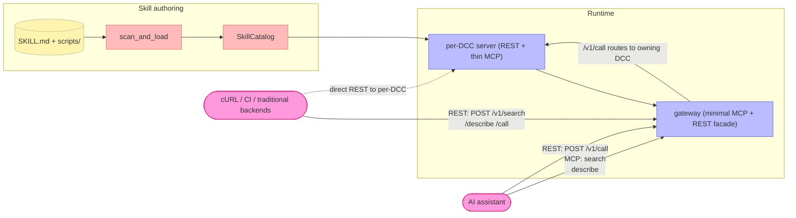

# What is DCC-MCP-Core?

**DCC-MCP-Core** is a Rust-first library (with Python bindings) that exposes capabilities inside DCC (Digital Content Creation) tools — Maya, Blender, Houdini, Photoshop, ZBrush, Unreal, Unity, Figma, and custom studio hosts — through a **layered surface**:

- **AI assistants** → a small, static **MCP** discovery set (`search`, `describe`) via the gateway, plus REST `/v1/*` for execution.
- **Traditional callers** (cURL, CI, any HTTP client) → a full **`/v1/*` REST API** on every per-DCC server and on the gateway facade.

The core is Rust, compiled to a Python extension via [PyO3](https://pyo3.rs/) + [maturin](https://github.com/PyO3/maturin). Zero Python runtime dependencies.

---

## Core workflow (2026-05 refresh)



**Architectural decisions that shape the whole repo**:

1. **Minimal MCP surface (#657 / #674, landed in PR A)** — the gateway's `tools/list` *always* returns only read-only discovery primitives, no matter how many DCCs are connected. Per-tool backend tools are discovered through MCP `search` / `describe` or REST `/v1/search` / `/v1/describe`; execution happens through REST `/v1/call` / `/v1/call_batch`.
2. **REST is the invocation plane** — every per-DCC server exposes a full `/v1/*` REST surface, and the gateway mirrors it as an aggregating facade. Any language / any client integrates here without touching MCP.
3. **Single contract** — REST `POST /v1/call` and hidden MCP compatibility routes share one `call_service` code path. Request/response envelopes are identical, locked down by an OpenAPI snapshot test.
4. **Progressive discovery** — agents pay only for what they ask for: `search(kind="skill")` or `/v1/search` → `/v1/load_skill` when needed → `search` → `describe` → `/v1/call`.

---

## Key features

- **Skills-First** — drop a `SKILL.md` (agentskills.io 1.0 + `metadata.dcc-mcp.*` extensions) beside a scripts directory and it becomes addressable MCP tools *and* REST routes.
- **Minimal MCP gateway** — `tools/list` is a bounded, cached static set. Agent context footprint stays flat regardless of DCC count.
- **per-DCC REST** — `/v1/healthz`, `/v1/readyz` (three-state Ready / Booting / Unreachable), `/v1/search`, `/v1/describe`, `/v1/call`, `/v1/context`, `/v1/openapi.json`. Full OpenAPI 3.x.
- **Multi-DCC gateway aggregation** — file-based service registry + TCP-probe health checks, auto-evicts instances after 3 consecutive probe failures, prunes ghost rows, arbitrates contention via a three-tier `crate_version → adapter_version → adapter_dcc` election.
- **Tool slug contract** — `<dcc>.<id8>.<tool>` three-part slugs are the only addressable form; the gateway parses them to route REST `/v1/call` to the owning backend.
- **Tunnels (#504)** — `dcc-mcp-tunnel-relay` + `dcc-mcp-tunnel-agent` binaries for zero-config remote access from SaaS AI clients to a workstation's DCC.
- **PyO3 bindings** — every Rust-accelerated API transparent to Python. Zero Python runtime deps.

---

## Architecture

42-package Rust workspace (41 functional packages + `workspace-hack`; root `Cargo.toml` is the source of truth), compiled by maturin into a single Python extension `dcc_mcp_core._core`:

```
dcc-mcp-core/
├── src/lib.rs                       # PyO3 module entry (_core)
├── crates/
│   ├── dcc-mcp-models/              # ToolResult, SkillMetadata, ToolDeclaration
│   ├── dcc-mcp-actions/             # ToolRegistry, EventBus, Pipeline, Dispatcher, Validator
│   ├── dcc-mcp-skills/              # SkillScanner, SkillCatalog, SkillWatcher
│   ├── dcc-mcp-protocols/           # MCP type definitions
│   ├── dcc-mcp-jsonrpc/             # JSON-RPC builders + dispatch (#484 / #492)
│   ├── dcc-mcp-wire/                # canonical MCP/REST envelopes + normalization
│   ├── dcc-mcp-transport/           # FileRegistry, IPC, WebSocket bridge
│   ├── dcc-mcp-process/             # launch / monitor / crash recovery
│   ├── dcc-mcp-telemetry/           # Prometheus exporter
│   ├── dcc-mcp-sandbox/             # safety policy + audit log
│   ├── dcc-mcp-shm/                 # cross-process zero-copy scene buffer
│   ├── dcc-mcp-capture/             # viewport screenshot
│   ├── dcc-mcp-usd/                 # USD stage bridge
│   ├── dcc-mcp-job/                 # DCC job scheduling core
│   ├── dcc-mcp-host/                # DccServerBase host skeleton
│   ├── dcc-mcp-workflow/            # YAML declarative workflows
│   ├── dcc-mcp-scheduler/           # cron / timers
│   ├── dcc-mcp-artefact/            # file/data hand-off between tools
│   ├── dcc-mcp-app-ui/              # DCC-agnostic app_ui contract types
│   ├── dcc-mcp-http-types/          # pure HTTP wire/config/value types, McpHttpConfig (#852)
│   ├── dcc-mcp-http-server/         # reusable HTTP runtime support (#852)
│   ├── dcc-mcp-http-py/             # PyO3 binding boundary for HTTP APIs (#852)
│   ├── dcc-mcp-http/                # McpHttpServer facade + compatibility re-exports
│   ├── dcc-mcp-skill-rest/          # per-DCC REST router (/v1/*)
│   ├── dcc-mcp-gateway-core/        # pure gateway domain/search/ranking types (#845)
│   ├── dcc-mcp-gateway-search/      # reusable capability search/ranking engine
│   ├── dcc-mcp-gateway/             # multi-instance gateway + minimal MCP surface
│   ├── dcc-mcp-cli/                 # `dcc-mcp-cli` client/control-plane CLI
│   ├── dcc-mcp-server/              # `dcc-mcp-server` CLI
│   ├── dcc-mcp-tunnel-protocol/     # tunnel frame format + JWT
│   ├── dcc-mcp-tunnel-relay/        # `dcc-mcp-tunnel-relay` CLI + library
│   ├── dcc-mcp-tunnel-agent/        # `dcc-mcp-tunnel-agent` CLI + library
│   ├── dcc-mcp-catalog/             # public adapter catalog search/describe
│   ├── dcc-mcp-logging/             # file logging + rotation
│   ├── dcc-mcp-paths/               # platform path helpers
│   ├── dcc-mcp-pybridge/            # PyO3 utilities
│   ├── dcc-mcp-pybridge-derive/     # derive macros for PyO3 bridge helpers
│   ├── dcc-mcp-naming/              # client-safe tool-name validation
│   └── workspace-hack/              # cargo-hakari feature unification
└── python/
    └── dcc_mcp_core/
        ├── __init__.py              # public API re-exports from _core
        ├── constants.py             # METADATA_*, LAYER_*, CATEGORY_* (#487)
        ├── result_envelope.py       # ToolResult factories (#487)
        ├── _server/                 # DccServerBase collaborators (#486)
        └── _core.pyi                # type stubs for every public API
```

---

## Python API overview

All public APIs import directly from `dcc_mcp_core`. AI agents should read [`llms.txt`](https://github.com/loonghao/dcc-mcp-core/blob/main/llms.txt) first (compact index) and fall back to [`llms-full.txt`](https://github.com/loonghao/dcc-mcp-core/blob/main/llms-full.txt) only when it lacks detail:

```python
from dcc_mcp_core import (
    # Skills-First entry points
    DccServerBase, create_skill_server,
    SkillCatalog, SkillMetadata, ToolDeclaration,
    scan_and_load, scan_and_load_lenient, scan_and_load_strict,
    scan_and_load_team, scan_and_load_user,

    # Result envelope (#487)
    ToolResult, success_result, error_result,
    skill_success_with_chart, skill_success_with_table, skill_success_with_image,

    # Metadata constants (#487)
    METADATA_DCC_MCP, METADATA_RECIPES_KEY, METADATA_WORKFLOWS_KEY,
    LAYER_THIN_HARNESS, LAYER_INFRASTRUCTURE, LAYER_DOMAIN, LAYER_EXAMPLE,
    CATEGORY_DIAGNOSTICS, CATEGORY_FEEDBACK,

    # Actions
    ToolRegistry, ToolDispatcher, ToolPipeline, ToolValidator,
    ToolRecorder, ToolMetrics, EventBus,

    # MCP HTTP server
    McpHttpServer, McpHttpConfig, MinimalModeConfig,

    # Progressive loading & lifecycle
    register_quit_hook, check_dcc_cancelled, check_cancelled,
    BaseDccCallableDispatcherFull, HostExecutionBridge, DeferredToolResult,

    # Multi-DCC gateway
    DccGatewayElection,

    # Protocol types
    ToolDefinition, ToolAnnotations, ResourceDefinition, PromptDefinition,

    # Other domains
    IpcChannelAdapter, PySharedSceneBuffer,
    Capturer, CaptureFrame, UsdStage, UsdPrim,
)
```

Full symbol listing lives in the [API reference](/api/actions).

---

## Recent breaking changes (2026-05)

> This table is for callers in the middle of an upgrade. Full history in [`CHANGELOG.md`](https://github.com/loonghao/dcc-mcp-core/blob/main/CHANGELOG.md).

| Change | Impact | Migration |
|---|---|---|
| **Gateway MCP surface converged** | `GatewayToolExposure` enum, `tool_exposure` / `publishes_backend_tools` config, `--gateway-tool-exposure` CLI flag all removed | Drop the code/config/env var; the gateway has a single (minimal) surface now |
| **Gateway wrapper payloads are strict** | `call_tool`, `call_tools`, `/v1/call`, and `/v1/call_batch` normalize through `dcc-mcp-wire`; backend fields at the wrapper top level are ignored/rejected | Send `{tool_slug, arguments?, meta?}` and put tool input inside `arguments`; use `normalize_tool_arguments()` in Python host wrappers |
| **Gateway prompt names are cursor-safe** | Aggregated prompt names use `i_<id8>__<escaped>` instead of raw backend names | Store the returned prompt name exactly as listed; do not reconstruct it from DCC/tool names |
| **Flat-form SKILL.md parser dropped** | `metadata: { "dcc-mcp.dcc": ... }` no longer populates typed fields | Use the nested form: `metadata: { dcc-mcp: { dcc: ... } }` |
| **`register_dcc_api_docs` / `DccApiDoc*` removed** | Related Python API is gone | Use `register_docs_resource()` instead |
| **Legacy top-level SKILL.md extension keys rejected** | Top-level `recipes:`, `workflows:`, etc. in frontmatter are no longer accepted | Move them under `metadata.dcc-mcp.*` |
| **IPC handlers renamed (#486)** | `get_action_metrics` → `get_tool_metrics`, `dispatch_action` → `dispatch_tool` | Update IPC callers |

---

## Version / language support

- **Current version**: 0.17.26 <!-- x-release-please-version -->
- **Python**: 3.7–3.13 (`abi3-py38` wheel)
- **Rust**: Edition 2024; MSRV pinned in `rust-toolchain.toml` at the repo root
- **Build**: maturin + PyO3

---

## Next reads

- [REST API surface](/guide/rest-api-surface) — `/v1/search`, `/v1/describe`, `/v1/call`, `tool_slug` format, OpenAPI snapshot
- [CLI reference](/guide/cli-reference) — full flag tables for `dcc-mcp-server`, `dcc-mcp-tunnel-relay`, `dcc-mcp-tunnel-agent`, plus deployment scenarios
- [Gateway diagnostics](/guide/gateway-diagnostics) — multi-instance contention, election, heartbeat, ghost eviction, troubleshooting matrix
- [`AGENTS.md`](https://github.com/loonghao/dcc-mcp-core/blob/main/AGENTS.md) — rules for integrating AI agents
- [`AI_AGENT_GUIDE.md`](https://github.com/loonghao/dcc-mcp-core/blob/main/AI_AGENT_GUIDE.md) — best practices for agents using dcc-mcp-core

## Related projects

- [dcc-mcp-maya](https://github.com/loonghao/dcc-mcp-maya) — Maya adapter
- [dcc-mcp-blender](https://github.com/loonghao/dcc-mcp-blender) — Blender adapter
- [dcc-mcp-houdini](https://github.com/loonghao/dcc-mcp-houdini) — Houdini adapter
- [dcc-mcp-photoshop](https://github.com/loonghao/dcc-mcp-photoshop) — Photoshop adapter
