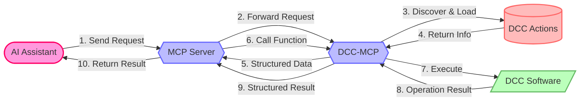

# What is DCC-MCP-Core?

DCC-MCP-Core is a **foundational library** for the Digital Content Creation (DCC) Model Context Protocol (MCP) ecosystem, providing a unified interface that allows AI to interact with various DCC software such as Maya, Blender, Houdini, and more.

The core is written in **Rust** and exposed to Python via **PyO3**, delivering zero-dependency performance with a clean Python API.

## Core Workflow



## Key Features

- **Rust-Powered Core** — All logic implemented in Rust via PyO3 for maximum performance
- **Zero Python Dependencies** — Python 3.8+ with no third-party runtime dependencies
- **ActionRegistry** — Thread-safe action registration and lookup using DashMap
- **EventBus** — Publish/subscribe event system for decoupled communication
- **Skills System** — Zero-code registration of scripts as MCP tools via SKILL.md
- **MCP Protocol Types** — Full MCP type definitions (Tools, Resources, Prompts)
- **Type Wrappers** — RPyC-compatible type wrappers for safe remote calls
- **Platform Utilities** — Cross-platform filesystem paths, logging, and constants

## Architecture

DCC-MCP-Core uses a Rust workspace with 5 sub-crates, compiled into a single Python extension module `dcc_mcp_core._core`:

```
dcc-mcp-core/                      # Rust workspace root
├── src/lib.rs                     # PyO3 module entry point → _core.pyd/.so
├── python/dcc_mcp_core/
│   ├── __init__.py                # Python re-exports from _core
│   └── py.typed                   # PEP 561 marker
└── crates/
    ├── dcc-mcp-models/            # ActionResultModel, SkillMetadata
    ├── dcc-mcp-actions/           # ActionRegistry, EventBus
    ├── dcc-mcp-protocols/         # MCP type definitions
    ├── dcc-mcp-skills/            # SKILL.md scanning and loading
    └── dcc-mcp-utils/             # Filesystem, constants, type wrappers, logging
```

All Python imports come from the top-level `dcc_mcp_core` package:

```python
from dcc_mcp_core import (
    ActionResultModel, ActionRegistry, EventBus,
    SkillScanner, SkillMetadata,
    ToolDefinition, ToolAnnotations,
    ResourceDefinition, PromptDefinition,
    success_result, error_result,
    get_config_dir, get_actions_dir,
)
```

## Related Projects

- [dcc-mcp-rpyc](https://github.com/loonghao/dcc-mcp-rpyc) — RPyC bridge for remote DCC operations
- [dcc-mcp-maya](https://github.com/loonghao/dcc-mcp-maya) — Maya MCP server implementation
