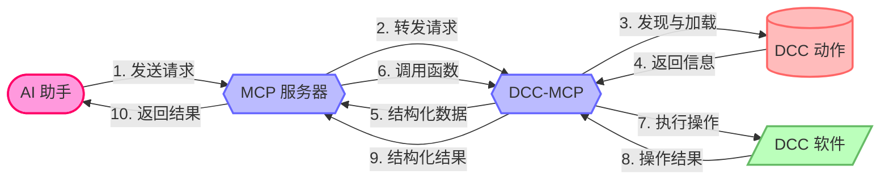

# 什么是 DCC-MCP-Core？

DCC-MCP-Core 是 DCC（数字内容创建）模型上下文协议（MCP）生态系统的**基础库**，提供统一接口，使 AI 能够与 Maya、Blender、Houdini 等 DCC 软件交互。

核心使用 **Rust** 编写，通过 **PyO3** 暴露为 Python API，实现零依赖高性能。

## 核心工作流程



## 核心特性

- **Rust 驱动核心** — 所有逻辑使用 Rust 实现，通过 PyO3 提供极致性能
- **零 Python 依赖** — Python 3.8+ 无第三方运行时依赖
- **ActionRegistry** — 使用 DashMap 的线程安全动作注册与查询
- **EventBus** — 发布/订阅事件系统，实现解耦通信
- **Skills 技能包** — 零代码将脚本注册为 MCP 工具（通过 SKILL.md）
- **MCP 协议类型** — 完整的 MCP 类型定义（Tools、Resources、Prompts）
- **类型包装器** — RPyC 兼容的类型包装器，确保远程调用安全
- **平台工具** — 跨平台文件系统路径、日志和常量

## 架构

DCC-MCP-Core 使用 Rust workspace，包含 5 个子 crate，编译为单个 Python 扩展模块 `dcc_mcp_core._core`：

```
dcc-mcp-core/                      # Rust workspace 根目录
├── src/lib.rs                     # PyO3 模块入口 → _core.pyd/.so
├── python/dcc_mcp_core/
│   ├── __init__.py                # Python 从 _core 重新导出
│   └── py.typed                   # PEP 561 标记
└── crates/
    ├── dcc-mcp-models/            # ActionResultModel, SkillMetadata
    ├── dcc-mcp-actions/           # ActionRegistry, EventBus
    ├── dcc-mcp-protocols/         # MCP 类型定义
    ├── dcc-mcp-skills/            # SKILL.md 扫描与加载
    └── dcc-mcp-utils/             # 文件系统、常量、类型包装器、日志
```

所有 Python 导入均来自顶层 `dcc_mcp_core` 包：

```python
from dcc_mcp_core import (
    ActionResultModel, ActionRegistry, EventBus,
    SkillScanner, SkillMetadata,
    ToolDefinition, ToolAnnotations,
    ResourceDefinition, PromptDefinition,
    success_result, error_result,
    get_config_dir, get_actions_dir,
)
```

## 相关项目

- [dcc-mcp-rpyc](https://github.com/loonghao/dcc-mcp-rpyc) — 远程 DCC 操作的 RPyC 桥接
- [dcc-mcp-maya](https://github.com/loonghao/dcc-mcp-maya) — Maya MCP 服务器实现
