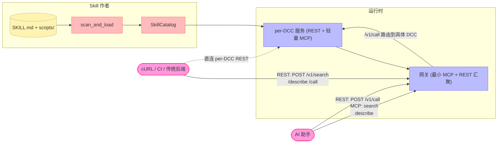

# 什么是 DCC-MCP-Core？

**DCC-MCP-Core** 是一套 Rust 基础库（含 Python 绑定），把 DCC（数字内容创作）软件中的"能力"—— Maya、Blender、Houdini、Photoshop、ZBrush、Unreal、Unity、Figma 等 ——分层暴露给两类消费者：

- **AI 助手** → 通过 gateway 的**少量、固定、只读** **MCP 发现工具**（`search` / `describe`），再用 REST `/v1/*` 执行。
- **传统调用方** →（cURL / CI / 任意 HTTP 客户端）通过**完整的 `/v1/*` REST 服务**。

底层是 Rust，通过 [PyO3](https://pyo3.rs/) + [maturin](https://github.com/PyO3/maturin) 编译成一个 Python 扩展模块。零 Python 运行时依赖。

---

## 核心工作流程（2026-05 更新）



**关键架构决策**：

1. **MCP 表面最小化（#657/#674，PR A 落地）** —— 网关的 `tools/list` **永远**只返回四个工作流原语（`search`、`describe`、`load_skill`、`call`），不管连了多少 DCC。per-tool 后端工具通过 MCP `search` / `describe` 或 REST `/v1/search` / `/v1/describe` 动态发现；执行走 MCP `call` 或 REST `/v1/call` / `/v1/call_batch`，绝不在 `tools/list` 里扇出。
2. **REST 是纯 HTTP twin** —— 每个 per-DCC 服务都暴露完整的 `/v1/*` REST API，网关也把同样形状作为汇聚面板暴露。任何语言、任何客户端都能直接调用，不需要 MCP 协议栈。
3. **单一契约** —— MCP `call`、REST `POST /v1/call` 和隐藏 MCP 兼容路由走同一条 `call_service` 代码路径，输入/输出 envelope 完全一致（由 OpenAPI snapshot 测试锁定）。
4. **渐进式发现** —— Agent 按需付费：`search(kind="skill")` 或 `/v1/search` → 必要时 `load_skill` 或 `/v1/load_skill` → `search` → `describe` → `call` 或 `/v1/call`。

---

## 核心特性

- **Skills-First** —— 任何脚本目录带上一个 `SKILL.md`（agentskills.io 1.0 + `metadata.dcc-mcp.*` 扩展）就能自动注册成 MCP 工具和 REST 路由。
- **最小 MCP 网关** —— `tools/list` 是静态的少量工具，缓存一次。上下文占用随 DCC 数量变化为 0。
- **per-DCC REST** —— `/v1/healthz`、`/v1/readyz`（三态 Ready / Booting / Unreachable）、`/v1/search`、`/v1/describe`、`/v1/call`、`/v1/context`、`/v1/openapi.json`。完整的 OpenAPI 3.x。
- **多 DCC 网关汇聚** —— 文件型服务注册表 + TCP 心跳探测，自动剔除 3 连失败的实例、清理 ghost 行，基于 `crate_version → adapter_version → adapter_dcc` 的三级选举仲裁。
- **Tool Slug 契约** —— `<dcc>.<id8>.<tool>` 三段 slug 是唯一的全局寻址方式，网关据此把 REST `/v1/call` 路由到正确的后端。
- **Tunnel（#504）** —— `dcc-mcp-tunnel-relay` + `dcc-mcp-tunnel-agent` 两个可执行二进制，让远程 AI 客户端直接访问工作站上的 DCC。
- **PyO3 绑定** —— Rust 加速的一切从 Python 透明可用；零 Python 运行时依赖。

---

## 架构

仓库是一个 43 个包的 Rust workspace（42 个功能包 + `workspace-hack`；根 `Cargo.toml` 是成员列表的唯一来源），由 maturin 编译成单一 Python 扩展 `dcc_mcp_core._core`：

```
dcc-mcp-core/
├── src/lib.rs                       # PyO3 模块入口 (_core)
├── crates/
│   ├── dcc-mcp-models/              # ToolResult, SkillMetadata, ToolDeclaration
│   ├── dcc-mcp-actions/             # ToolRegistry, EventBus, Pipeline, Dispatcher, Validator
│   ├── dcc-mcp-skills/              # SkillScanner, SkillCatalog, SkillWatcher
│   ├── dcc-mcp-protocols/           # MCP 类型定义
│   ├── dcc-mcp-jsonrpc/             # JSON-RPC 构造器与分发（#484 / #492）
│   ├── dcc-mcp-wire/                # canonical MCP/REST envelope 与参数归一化
│   ├── dcc-mcp-transport/           # FileRegistry、IPC、WebSocket 桥
│   ├── dcc-mcp-process/             # 启动 / 监控 / 崩溃恢复
│   ├── dcc-mcp-telemetry/           # Prometheus exporter
│   ├── dcc-mcp-sandbox/             # 安全策略与审计
│   ├── dcc-mcp-shm/                 # 跨进程零拷贝场景缓冲
│   ├── dcc-mcp-capture/             # 视口截图
│   ├── dcc-mcp-usd/                 # USD Stage 桥
│   ├── dcc-mcp-job/                 # DCC 作业调度核心
│   ├── dcc-mcp-host/                # DccServerBase 主机骨架
│   ├── dcc-mcp-workflow/            # YAML 声明式工作流
│   ├── dcc-mcp-scheduler/           # cron / 定时器
│   ├── dcc-mcp-artefact/            # 工具之间的文件/数据交接
│   ├── dcc-mcp-http-types/          # 纯 HTTP 线协议/配置/值类型、McpHttpConfig（#852）
│   ├── dcc-mcp-http-server/         # 可复用 HTTP runtime 支撑层（#852）
│   ├── dcc-mcp-http-py/             # HTTP API 的 PyO3 绑定边界（#852）
│   ├── dcc-mcp-http/                # McpHttpServer facade + 兼容 re-export
│   ├── dcc-mcp-skill-rest/          # per-DCC REST 路由(`/v1/*`)
│   ├── dcc-mcp-gateway-core/        # 纯 gateway 领域/search/ranking 类型（#845）
│   ├── dcc-mcp-gateway-search/      # 可复用 capability search/ranking 引擎
│   ├── dcc-mcp-gateway/             # 多实例网关 + 最小 MCP 表面
│   ├── dcc-mcp-server/              # `dcc-mcp-server` CLI
│   ├── dcc-mcp-sidecar/             # per-DCC sidecar + gateway-daemon runtime
│   ├── dcc-mcp-tunnel-protocol/     # 隧道帧格式 + JWT
│   ├── dcc-mcp-tunnel-relay/        # `dcc-mcp-tunnel-relay` CLI + 库
│   ├── dcc-mcp-tunnel-agent/        # `dcc-mcp-tunnel-agent` CLI + 库
│   ├── dcc-mcp-catalog/             # 公开适配器目录 search/describe
│   ├── dcc-mcp-logging/             # 文件日志 + 滚动策略
│   ├── dcc-mcp-paths/               # 平台路径帮助函数
│   ├── dcc-mcp-pybridge/            # PyO3 工具
│   ├── dcc-mcp-pybridge-derive/     # PyO3 bridge helper 的 derive 宏
│   ├── dcc-mcp-naming/              # 客户端安全工具名校验
│   └── workspace-hack/              # cargo-hakari 统一特性
└── python/
    └── dcc_mcp_core/
        ├── __init__.py              # 从 _core 重导出公共 API
        ├── constants.py             # METADATA_*, LAYER_*, CATEGORY_*（#487）
        ├── result_envelope.py       # ToolResult 工厂（#487）
        ├── _server/                 # DccServerBase 协作者（#486）
        └── _core.pyi                # 所有公开 API 的类型桩
```

---

## Python API 概览

所有公共 API 都能从顶层 `dcc_mcp_core` 直接导入。AI Agent 建议先读 [`llms.txt`](https://github.com/dcc-mcp/dcc-mcp-core/blob/main/llms.txt)（精简索引），再按需翻 [`llms-full.txt`](https://github.com/dcc-mcp/dcc-mcp-core/blob/main/llms-full.txt)（完整索引）：

```python
from dcc_mcp_core import (
    # Skills-First 入口
    DccServerBase, create_skill_server,
    SkillCatalog, SkillMetadata, ToolDeclaration,
    scan_and_load, scan_and_load_lenient, scan_and_load_strict,
    scan_and_load_team, scan_and_load_user,

    # 结果封装（#487）
    ToolResult, success_result, error_result,
    skill_success_with_chart, skill_success_with_table, skill_success_with_image,

    # 元数据常量（#487）
    METADATA_DCC_MCP, METADATA_RECIPES_KEY, METADATA_WORKFLOWS_KEY,
    LAYER_THIN_HARNESS, LAYER_INFRASTRUCTURE, LAYER_DOMAIN, LAYER_EXAMPLE,
    CATEGORY_DIAGNOSTICS, CATEGORY_FEEDBACK,

    # Actions
    ToolRegistry, ToolDispatcher, ToolPipeline, ToolValidator,
    ToolRecorder, ToolMetrics, EventBus,

    # MCP HTTP 服务器
    McpHttpServer, McpHttpConfig, MinimalModeConfig,

    # 渐进式加载与生命周期
    register_quit_hook, check_dcc_cancelled, check_cancelled,
    BaseDccCallableDispatcherFull, HostExecutionBridge, DeferredToolResult,

    # 多 DCC 网关
    DccGatewayElection,

    # 协议类型
    ToolDefinition, ToolAnnotations, ResourceDefinition, PromptDefinition,

    # 其他领域
    IpcChannelAdapter, PySharedSceneBuffer,
    Capturer, CaptureFrame, UsdStage, UsdPrim,
)
```

完整符号清单见 [API 参考](/zh/api/actions)。

---

## 最近的破坏性更改（2026-05）

> 这一节专门给升级中的调用方。完整历史见 [`CHANGELOG.md`](https://github.com/dcc-mcp/dcc-mcp-core/blob/main/CHANGELOG.md)。

| 变更 | 影响 | 迁移 |
|---|---|---|
| **网关 REST 默认 compact TOON** | `/v1/search`、`/v1/describe`、`/v1/call`、直接 instance describe/call 和 `/v1/call_batch` 默认返回 `application/toon` | 需要旧 JSON 时发送 `Accept: application/json` 或 body `response_format: "json"`；迁移窗口可临时设置 `DCC_MCP_GATEWAY_RESPONSE_FORMAT=json` |
| **网关 MCP 表面收敛** | `GatewayToolExposure` 枚举、`tool_exposure` / `publishes_backend_tools` 配置、`--gateway-tool-exposure` CLI 标志全部移除 | 删掉对应代码/配置/环境变量；网关现在只有一种（最小）表面 |
| **网关 wrapper payload 更严格** | MCP `call`、隐藏 `call_tool` / `call_tools`、`/v1/call`、`/v1/call_batch` 都经过 `dcc-mcp-wire` 归一化；wrapper 顶层的后端字段会被忽略或拒绝 | 发送 `{tool_slug, arguments?, meta?}` 或 `{calls:[...]}`，把工具输入放进 `arguments`；Python host wrapper 使用 `normalize_tool_arguments()` |
| **网关 prompt 名称对 Cursor 安全** | 聚合 prompt 名称使用 `i_<id8>__<escaped>`，不再暴露原始后端名称 | 原样保存并使用 `prompts/list` 返回的名称，不要从 DCC/tool 名称自行拼接 |
| **删除 SKILL.md flat-form 解析** | `metadata: { "dcc-mcp.dcc": ... }` 不再填充典型字段 | 改用 nested form：`metadata: { dcc-mcp: { dcc: ... } }` |
| **删除 `register_dcc_api_docs` / `DccApiDoc*`** | 相关 Python API 不再存在 | 用 `register_docs_resource()` 替代 |
| **拒绝顶层 SKILL.md 扩展键** | `recipes:`、`workflows:` 等在 frontmatter 顶层不再被接受 | 移到 `metadata.dcc-mcp.*` 命名空间 |
| **IPC 处理程序重命名（#486）** | `get_action_metrics` → `get_tool_metrics`，`dispatch_action` → `dispatch_tool` | 更新 IPC 调用方 |

---

## 版本 / 语言支持

- **当前版本**：0.18.8 <!-- x-release-please-version -->
- **Python**：3.7–3.13（`abi3-py38` wheel）
- **Rust**：Edition 2024；MSRV 见仓库根 `rust-toolchain.toml`
- **构建**：maturin + PyO3

---

## 下一步

- [REST API 接入指南](/zh/guide/rest-api-surface) —— `/v1/search`、`/v1/describe`、`/v1/call`、`tool_slug` 格式、OpenAPI snapshot
- [CLI 参考](/zh/guide/cli-reference) —— `dcc-mcp-server`、`dcc-mcp-tunnel-relay`、`dcc-mcp-tunnel-agent` 的完整旗标 + 典型部署场景
- [网关争用与调试](/zh/guide/gateway-diagnostics) —— 多实例竞争、选举、心跳、ghost 清除、故障排查手册
- [`AGENTS.md`](https://github.com/dcc-mcp/dcc-mcp-core/blob/main/AGENTS.md) —— AI Agent 接入核心规则
- [`AI_AGENT_GUIDE.md`](https://github.com/dcc-mcp/dcc-mcp-core/blob/main/AI_AGENT_GUIDE.md) —— AI Agent 使用 dcc-mcp-core 的最佳实践

## 相关项目

- [dcc-mcp-maya](https://github.com/dcc-mcp/dcc-mcp-maya) — Maya 适配器
- [dcc-mcp-blender](https://github.com/dcc-mcp/dcc-mcp-blender) — Blender 适配器
- [dcc-mcp-houdini](https://github.com/dcc-mcp/dcc-mcp-houdini) — Houdini 适配器
- [dcc-mcp-photoshop](https://github.com/dcc-mcp/dcc-mcp-photoshop) — Photoshop 适配器
